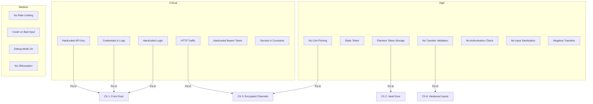

import Tabs from '@theme/Tabs';
import TabItem from '@theme/TabItem';

# Threat Briefing — Part 2

> *"Security is not a product, but a process."* — Bruce Schneier

## Guided Threat Audit

Now that the app is running, you are going to walk through it screen by screen and record every vulnerability you find. This is exactly what a penetration tester does on day one of an engagement.

Grab a notebook or open a markdown file. For each finding, note:

1. **Where** — the file and line
2. **What** — the vulnerability category (OWASP M-number)
3. **Severity** — Critical / High / Medium / Low
4. **Why it matters** — what an attacker could do with it

### Audit: Authentication (auth_service.dart)

Open `lib/services/auth_service.dart` and look for:

```dart title="lib/services/auth_service.dart (VULNERABLE)"
class AuthService {
  static const String _apiKey = 'sk_live_securebank_9a8b7c6d5e4f3g2h1i';

  Future<bool> login(String email, String password) async {
    print('Login attempt: email=$email, password=$password');

    if (email == 'admin@securebank.co.uk' && password == 'password123') {
      final prefs = await SharedPreferences.getInstance();
      await prefs.setString('auth_token', 'static_token_abc123');
      await prefs.setString('api_key', _apiKey);
      return true;
    }
    return false;
  }
}
```

| # | Vulnerability | OWASP | Severity |
|---|---|---|---|
| 1 | API key hardcoded in source | M1 | Critical |
| 2 | Credentials logged to console with `print()` | M1 | Critical |
| 3 | Hardcoded username/password comparison | M1 | Critical |
| 4 | Auth token stored in SharedPreferences (plaintext) | M9 | High |
| 5 | Static token — never rotates, never expires | M3 | High |
| 6 | No rate limiting on login attempts | M3 | Medium |

### Audit: Network Layer (api_service.dart)

```dart title="lib/services/api_service.dart (VULNERABLE)"
class ApiService {
  // highlight-next-line
  static const String baseUrl = 'http://api.securebank.co.uk';

  Future<Map<String, dynamic>> getBalance(String accountId) async {
    final response = await http.get(
      Uri.parse('$baseUrl/accounts/$accountId/balance'),
      headers: {'Authorization': 'Bearer static_token_abc123'},
    );
    return jsonDecode(response.body);
  }

  Future<void> transfer({
    required String fromAccount,
    required String toAccount,
    required double amount,
  }) async {
    await http.post(
      Uri.parse('$baseUrl/transfer'),
      body: jsonEncode({
        'from': fromAccount,
        'to': toAccount,
        // highlight-next-line
        'amount': amount, // No validation — negative amounts?
      }),
    );
  }
}
```

| # | Vulnerability | OWASP | Severity |
|---|---|---|---|
| 7 | HTTP instead of HTTPS | M5 | Critical |
| 8 | No certificate pinning | M5 | High |
| 9 | Hardcoded bearer token in requests | M1 | Critical |
| 10 | No input validation on transfer amount | M4 | High |
| 11 | Account ID passed without authorisation check | M3 | High |

### Audit: UI Layer (transfer_screen.dart)

```dart title="lib/screens/transfer_screen.dart (VULNERABLE)"
class _TransferScreenState extends State<TransferScreen> {
  final _amountController = TextEditingController();
  final _recipientController = TextEditingController();

  void _submitTransfer() {
    final amount = double.parse(_amountController.text);
    ApiService().transfer(
      fromAccount: widget.accountId,
      toAccount: _recipientController.text,
      // highlight-next-line
      amount: amount, // No bounds check, no sanitisation
    );
    ScaffoldMessenger.of(context).showSnackBar(
      SnackBar(content: Text('Transferred £${amount.toStringAsFixed(2)}')),
    );
  }
}
```

| # | Vulnerability | OWASP | Severity |
|---|---|---|---|
| 12 | No input sanitisation on recipient field | M4 | High |
| 13 | `double.parse` with no error handling (crash) | M4 | Medium |
| 14 | Negative/zero amount transfers possible | M4 | High |

### Audit: Build Configuration

```dart title="lib/utils/constants.dart (VULNERABLE)"
class AppConstants {
  static const String apiKey = 'sk_live_securebank_9a8b7c6d5e4f3g2h1i';
  static const String sentryDsn = 'https://abc123@sentry.io/456';
  static const bool debugMode = true;
}
```

| # | Vulnerability | OWASP | Severity |
|---|---|---|---|
| 15 | Secrets duplicated in constants file | M1 | Critical |
| 16 | Debug mode enabled in production | M8 | Medium |
| 17 | No code obfuscation configured | M7 | Medium |

## Complete Vulnerability Map



## Security Fix Roadmap

Here is the order in which you will address each vulnerability class:

| Chapter | Focus | Vulnerabilities Fixed |
|---|---|---|
| **Ch 1** Front Door | Authentication & credentials | #1, #2, #3, #5, #6, #9, #15 |
| **Ch 2** Vault Door | Secure storage | #4 |
| **Ch 3** Encrypted Channels | Network security | #7, #8 |
| **Ch 4** Payload | Data encryption | Encryption at rest |
| **Ch 5** Access Control | Authorisation | #11 |
| **Ch 6** Hardened Inputs | Input validation | #10, #12, #13, #14 |
| **Ch 7** Obfuscation | Binary protection | #16, #17 |
| **Ch 8** Watchtower | Runtime monitoring | Tamper detection |
| **Ch 9** Biometrics | Biometric auth | Device-level security |
| **Ch 10** Pen Test | Security testing | Full audit |
| **Ch 11** Deployment | Secure release | CI/CD hardening |

Each chapter builds on the last. By Chapter 11, every item in this audit will be resolved.

## Deep Dive

Expand your understanding with these resources:

- [OWASP Mobile Top 10 (2024)](https://owasp.org/www-project-mobile-top-10/) — the definitive mobile risk list that drives this tutorial
- [OWASP Mobile Application Security Testing Guide (MASTG)](https://mas.owasp.org/MASTG/) — hands-on testing techniques for mobile apps
- [NIST SP 800-163: Vetting the Security of Mobile Applications](https://csrc.nist.gov/publications/detail/sp/800-163/rev-1/final) — government-grade mobile security guidance
- [Flutter Security FAQ](https://docs.flutter.dev/reference/security-false-positives) — Flutter team's own security documentation
- [Dart Security Advisories](https://github.com/dart-lang/sdk/security/advisories) — stay current with Dart platform vulnerabilities

## What's Next

In **Chapter 1: Locking the Front Door**, you will rip out the hardcoded credentials, eliminate password logging, and implement proper token-based authentication with session management. The front door is the first line of defence, and right now it is wide open.
