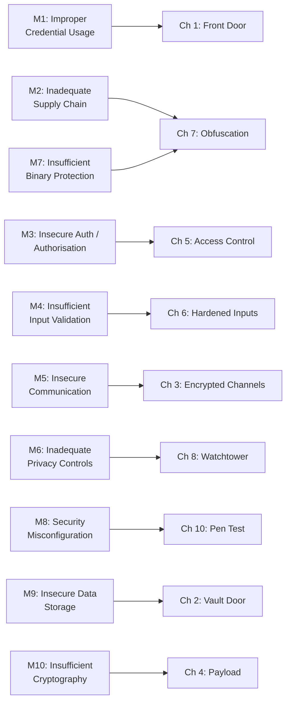

import Tabs from '@theme/Tabs';
import TabItem from '@theme/TabItem';

# Chapter 0: Threat Briefing

> *"The only truly secure system is one that is powered off, cast in a block of concrete, and sealed in a lead-lined room with armed guards."* — Gene Spafford

**Estimated time:** ~15 minutes | **Focus:** Whole app | **Branch:** `chapter-0-threat-briefing`

---

## Why Security Matters

In 2023, a mobile banking app in Southeast Asia shipped with an API key embedded directly in its Dart source code. Within 72 hours of launch, attackers decompiled the APK, extracted the key, and drained over 400 customer accounts. The fix took the team three weeks. The reputational damage was permanent.

This is not an edge case. Mobile apps are attacked constantly, and Flutter apps are no exception. The Dart AOT binary can be reverse-engineered. Network traffic can be intercepted. Local storage can be read on rooted devices.

**SecureBank** is a deliberately vulnerable banking app. Your job across this tutorial is to find every weakness and seal it shut.

## What You Will Build

By the end of this series, you will have transformed a leaking, insecure banking prototype into a hardened application that:

- Authenticates users with secure token-based sessions
- Stores secrets in platform-encrypted vaults
- Pins TLS certificates to prevent interception
- Validates and sanitises every input
- Monitors its own runtime for tampering

## The OWASP Mobile Top 10

The Open Worldwide Application Security Project (OWASP) maintains a list of the ten most critical mobile security risks. Every chapter in this tutorial maps to at least one.



| OWASP Risk | What It Means for Flutter | Our Chapter |
|---|---|---|
| **M1** Improper Credential Usage | Hardcoded API keys, passwords in logs | Ch 1 |
| **M3** Insecure Auth / Authorisation | Missing token validation, no session expiry | Ch 1, Ch 5 |
| **M5** Insecure Communication | HTTP calls, no certificate pinning | Ch 3 |
| **M9** Insecure Data Storage | Secrets in SharedPreferences (plaintext) | Ch 2 |
| **M10** Insufficient Cryptography | Weak or missing encryption for payloads | Ch 4 |
| **M4** Insufficient Input Validation | SQL injection, XSS in WebViews | Ch 6 |
| **M7** Insufficient Binary Protection | No obfuscation, debug symbols shipped | Ch 7 |

## Clone and Run the Vulnerable App

Time to see the damage first-hand.

### 1. Clone the Repository

```bash title="Terminal"
git clone https://github.com/team360r/SecureBank.git
cd SecureBank
git checkout chapter-0-threat-briefing
```

### 2. Install Dependencies

```bash title="Terminal"
flutter pub get
```

### 3. Run the App

```bash title="Terminal"
flutter run
```

You should see a login screen for **SecureBank Banking**. The app lets you:

- Log in with credentials
- View an account balance (in GBP)
- Transfer funds between accounts
- View transaction history

:::caution Deliberately Vulnerable
This starter app is packed with security flaws **on purpose**. Do not use any of this code in production. Every vulnerability you see is a teaching moment.
:::

### 4. Quick Smoke Test

Try logging in with these credentials:

```
Email: admin@securebank.co.uk
Password: password123
```

If that works on the first try with no rate limiting, no MFA prompt, and no token exchange visible in the logs, you have already found your first three vulnerabilities.

## The Starter App Structure

```
lib/
├── main.dart
├── models/
│   ├── account.dart
│   └── transaction.dart
├── screens/
│   ├── login_screen.dart        # Hardcoded credentials
│   ├── dashboard_screen.dart    # Balance in GBP (£)
│   └── transfer_screen.dart     # No input validation
├── services/
│   ├── api_service.dart         # HTTP, no pinning
│   └── auth_service.dart        # Plaintext storage
└── utils/
    └── constants.dart           # API key in source
```

Here is a taste of what lives inside `auth_service.dart`:

```dart title="lib/services/auth_service.dart (VULNERABLE)"
class AuthService {
  // highlight-next-line
  static const String _apiKey = 'sk_live_securebank_9a8b7c6d5e4f3g2h1i';

  Future<bool> login(String email, String password) async {
    // highlight-next-line
    print('Login attempt: email=$email, password=$password');

    if (email == 'admin@securebank.co.uk' && password == 'password123') {
      // highlight-next-line
      final prefs = await SharedPreferences.getInstance();
      await prefs.setString('auth_token', 'static_token_abc123');
      await prefs.setString('api_key', _apiKey);
      return true;
    }
    return false;
  }
}
```

:::danger Count the Flaws
How many security issues can you spot in this single file? We will come back to this in Part 2.
:::

At this stage, you have a running app and a general sense that things are very wrong. In Part 2, you will conduct a structured threat audit to catalogue every vulnerability before we begin fixing them.
