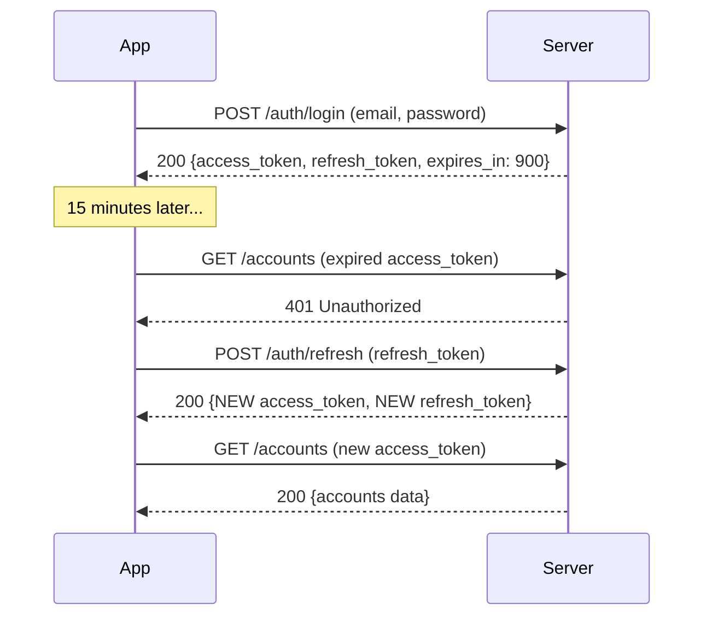

import Tabs from '@theme/Tabs';
import TabItem from '@theme/TabItem';

# Locking the Front Door — Part 2

> *"You don't stop a battering ram by making the door thicker. You stop it by making the attacker give up."* — Security proverb

## Rate Limiting Login Attempts

A brute-force attacker will hammer your login endpoint thousands of times per second. Server-side rate limiting is essential, but your app should also enforce client-side throttling to reduce unnecessary network calls and provide immediate user feedback.

```dart title="lib/services/login_rate_limiter.dart"
class LoginRateLimiter {
  static const int maxAttempts = 5;
  static const Duration lockoutDuration = Duration(minutes: 2);

  int _attemptCount = 0;
  DateTime? _lockoutUntil;

  /// Returns null if the attempt is allowed, or an error message if locked out.
  String? checkRateLimit() {
    if (_lockoutUntil != null && DateTime.now().isBefore(_lockoutUntil!)) {
      final remaining = _lockoutUntil!.difference(DateTime.now());
      final minutes = remaining.inMinutes;
      final seconds = remaining.inSeconds % 60;
      return 'Too many attempts. Try again in ${minutes}m ${seconds}s.';
    }

    // Reset if lockout has expired
    if (_lockoutUntil != null && DateTime.now().isAfter(_lockoutUntil!)) {
      _attemptCount = 0;
      _lockoutUntil = null;
    }

    return null;
  }

  /// Record a failed attempt. Returns true if now locked out.
  bool recordFailedAttempt() {
    _attemptCount++;
    if (_attemptCount >= maxAttempts) {
      _lockoutUntil = DateTime.now().add(lockoutDuration);
      return true;
    }
    return false;
  }

  /// Reset on successful login.
  void reset() {
    _attemptCount = 0;
    _lockoutUntil = null;
  }

  int get remainingAttempts => maxAttempts - _attemptCount;
}
```

:::info Defence in Depth
Client-side rate limiting is not a replacement for server-side throttling. An attacker can bypass the client entirely with direct API calls. Your server must also return HTTP 429 after too many requests from the same IP or account. The client-side limiter improves UX and reduces unnecessary traffic.
:::

## Session Management

Static tokens that never expire are equivalent to leaving your front door key under the mat permanently. Proper session management requires three things:

1. **Short-lived access tokens** (15-30 minutes)
2. **Refresh tokens** for seamless re-authentication
3. **Token rotation** on each refresh

```dart title="lib/services/session_manager.dart"
import 'dart:convert';
import 'dart:developer' as developer;
import 'package:http/http.dart' as http;

class SessionManager {
  final String _baseUrl;
  final http.Client _client;
  final TokenManager _tokenManager;

  SessionManager({
    required String baseUrl,
    required TokenManager tokenManager,
    http.Client? client,
  })  : _baseUrl = baseUrl,
        _tokenManager = tokenManager,
        _client = client ?? http.Client();

  /// Refresh the access token using the refresh token.
  /// Returns true if the refresh succeeded.
  Future<bool> refreshSession() async {
    final refreshToken = _tokenManager.refreshToken;
    if (refreshToken == null) {
      developer.log('No refresh token available', name: 'SessionManager');
      return false;
    }

    try {
      final response = await _client.post(
        Uri.parse('$_baseUrl/auth/refresh'),
        headers: {'Content-Type': 'application/json'},
        body: jsonEncode({'refresh_token': refreshToken}),
      );

      if (response.statusCode == 200) {
        final data = jsonDecode(response.body);
        _tokenManager.setTokens(
          accessToken: data['access_token'],
          // Token rotation: server issues a NEW refresh token each time
          refreshToken: data['refresh_token'],
          expiresIn: Duration(seconds: data['expires_in']),
        );
        developer.log('Session refreshed successfully',
            name: 'SessionManager');
        return true;
      } else {
        developer.log('Session refresh failed: ${response.statusCode}',
            name: 'SessionManager');
        _tokenManager.clear();
        return false;
      }
    } catch (e) {
      developer.log('Session refresh error: $e', name: 'SessionManager');
      return false;
    }
  }

  /// Make an authenticated request with automatic token refresh.
  Future<http.Response> authenticatedRequest(
    String method,
    String path, {
    Map<String, String>? headers,
    String? body,
  }) async {
    // First attempt
    var response = await _makeRequest(method, path,
        headers: headers, body: body);

    // If 401, try refreshing the token once
    if (response.statusCode == 401) {
      final refreshed = await refreshSession();
      if (refreshed) {
        response = await _makeRequest(method, path,
            headers: headers, body: body);
      }
    }

    return response;
  }

  Future<http.Response> _makeRequest(
    String method,
    String path, {
    Map<String, String>? headers,
    String? body,
  }) async {
    final token = _tokenManager.accessToken;
    final requestHeaders = {
      ...?headers,
      'Content-Type': 'application/json',
      if (token != null) 'Authorization': 'Bearer $token',
    };

    final uri = Uri.parse('$_baseUrl$path');

    switch (method.toUpperCase()) {
      case 'GET':
        return _client.get(uri, headers: requestHeaders);
      case 'POST':
        return _client.post(uri, headers: requestHeaders, body: body);
      case 'PUT':
        return _client.put(uri, headers: requestHeaders, body: body);
      case 'DELETE':
        return _client.delete(uri, headers: requestHeaders);
      default:
        throw UnsupportedError('HTTP method $method is not supported');
    }
  }
}
```



:::tip Token Rotation
Notice the server issues a **new** refresh token on every refresh call. This is called token rotation. If an attacker steals a refresh token, it becomes invalid the moment the legitimate user refreshes their session. The server can detect the reuse and invalidate all tokens for that user.
:::

## Before / After Comparison
<Tabs>
<TabItem value="before" label="Before (Vulnerable)" default>

```dart title="lib/services/auth_service.dart (VULNERABLE)"
class AuthService {
  static const String _apiKey = 'sk_live_securebank_9a8b7c6d5e4f3g2h1i';

  Future<bool> login(String email, String password) async {
    print('Login attempt: email=$email, password=$password');

    if (email == 'admin@securebank.co.uk' && password == 'password123') {
      final prefs = await SharedPreferences.getInstance();
      await prefs.setString('auth_token', 'static_token_abc123');
      await prefs.setString('api_key', _apiKey);
      return true;
    }
    return false;
  }

  Future<String?> getToken() async {
    final prefs = await SharedPreferences.getInstance();
    return prefs.getString('auth_token');
  }
}
```

**Problems:**
- API key hardcoded in source
- Credentials printed to device logs
- Hardcoded email/password comparison
- Static token stored in plaintext SharedPreferences
- Token never expires or rotates
- No rate limiting
</TabItem>
<TabItem value="after" label="After (Secure)">

```dart title="lib/services/auth_service.dart (SECURE)"
class AuthService {
  final String _baseUrl;
  final http.Client _client;
  final LoginRateLimiter _rateLimiter;

  AuthService({
    required String baseUrl,
    http.Client? client,
    LoginRateLimiter? rateLimiter,
  })  : _baseUrl = baseUrl,
        _client = client ?? http.Client(),
        _rateLimiter = rateLimiter ?? LoginRateLimiter();

  Future<AuthResult> login(String email, String password) async {
    // Client-side rate limiting
    final rateLimitError = _rateLimiter.checkRateLimit();
    if (rateLimitError != null) {
      return AuthResult.failure(rateLimitError);
    }

    // Safe logging — email partially redacted, password never logged
    developer.log(
      'Login attempt for: ${email.split('@').first}@***',
      name: 'AuthService',
    );

    try {
      final response = await _client.post(
        Uri.parse('$_baseUrl/auth/login'),
        headers: {'Content-Type': 'application/json'},
        body: jsonEncode({'email': email, 'password': password}),
      );

      if (response.statusCode == 200) {
        _rateLimiter.reset();
        final data = jsonDecode(response.body);
        return AuthResult.success(
          accessToken: data['access_token'],
          refreshToken: data['refresh_token'],
          expiresIn: Duration(seconds: data['expires_in']),
        );
      } else {
        _rateLimiter.recordFailedAttempt();
        if (response.statusCode == 429) {
          return AuthResult.failure('Too many attempts. Please wait.');
        }
        return AuthResult.failure('Invalid email or password');
      }
    } catch (e) {
      return AuthResult.failure('Connection error. Check your network.');
    }
  }
}
```

**Fixed:**
- No secrets in source code
- Credentials never logged
- Server-side authentication
- Short-lived JWTs with rotation
- Client-side rate limiting
- Proper error handling
</TabItem>
</Tabs>

## Deep Dive

Continue your research with these resources:

- [OWASP M1: Improper Credential Usage](https://owasp.org/www-project-mobile-top-10/2023-risks/m1-improper-credential-usage) — the full risk profile for hardcoded and mishandled credentials
- [JWT Introduction (jwt.io)](https://jwt.io/introduction) — understand JSON Web Token structure, signing, and verification
- [Flutter http package](https://pub.dev/packages/http) — the HTTP client used throughout this tutorial
- [OWASP Authentication Cheat Sheet](https://cheatsheetseries.owasp.org/cheatsheets/Authentication_Cheat_Sheet.html) — comprehensive server-side authentication guidance
- [dart:developer library](https://api.dart.dev/stable/dart-developer/dart-developer-library.html) — safe logging that is stripped from release builds

## What's Next

Your front door now has a proper lock, but the valuables inside are still sitting in a cardboard box. In **Chapter 2: The Vault Door**, you will move sensitive data from plaintext SharedPreferences into platform-encrypted secure storage, ensuring that even a rooted device cannot trivially read your users' tokens and keys.
