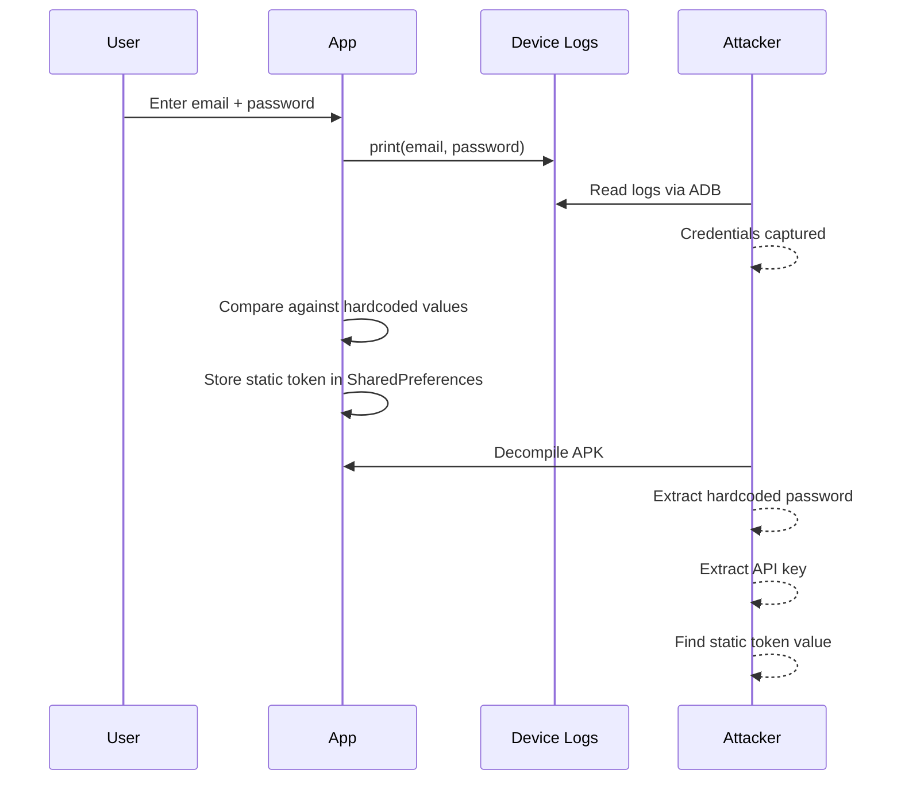

import Tabs from '@theme/Tabs';
import TabItem from '@theme/TabItem';

# Chapter 1: Locking the Front Door

> *"A chain is only as strong as its weakest link — and the login screen is where most chains shatter."* — Unknown

**Estimated time:** ~25 minutes | **Focus:** Login Screen | **Branch:** `chapter-1-front-door`

---

## The Vulnerability

Open `lib/services/auth_service.dart` from the starter project. Here is the authentication logic that is currently protecting your users' bank accounts:

```dart title="lib/services/auth_service.dart (VULNERABLE)"
import 'package:shared_preferences/shared_preferences.dart';

class AuthService {
  static const String _apiKey = 'sk_live_securebank_9a8b7c6d5e4f3g2h1i';

  Future<bool> login(String email, String password) async {
    // FLAW 1: Credentials written to device logs
    print('Login attempt: email=$email, password=$password');

    // FLAW 2: Hardcoded credential comparison
    if (email == 'admin@securebank.co.uk' && password == 'password123') {
      final prefs = await SharedPreferences.getInstance();
      // FLAW 3: Token stored in plaintext
      await prefs.setString('auth_token', 'static_token_abc123');
      // FLAW 4: API key copied to insecure storage
      await prefs.setString('api_key', _apiKey);
      return true;
    }
    return false;
  }

  Future<String?> getToken() async {
    final prefs = await SharedPreferences.getInstance();
    return prefs.getString('auth_token');
  }

  Future<void> logout() async {
    final prefs = await SharedPreferences.getInstance();
    await prefs.remove('auth_token');
  }
}
```

This code has six critical or high-severity issues. You identified them in Chapter 0. Now you will fix them.

## The Damage: What an Attacker Sees



Every step in this flow is exploitable. An attacker with five minutes and a USB cable can extract everything they need.

## Fix 1: Remove Credential Logging

The very first thing to do is stop printing credentials. In a production app you should use a structured logger that automatically redacts sensitive fields. For now, remove the `print` statement entirely and replace it with a safe alternative.

```dart title="lib/services/auth_service.dart"
import 'dart:developer' as developer;

// Safe logging — never include credentials
void _logAuthEvent(String event) {
  developer.log(
    event,
    name: 'AuthService',
    // In release builds, dart:developer logs are stripped
  );
}
```

:::tip Why dart:developer?
Unlike `print()`, `dart:developer.log()` is stripped from release builds by the Dart compiler. This gives you logging in debug mode without leaking data in production. For production logging, use a package like `logger` with sensitive-field redaction.
:::

## Fix 2: Server-Side Authentication

Hardcoded credentials must go. Authentication belongs on the server. Your app should send credentials to a secure endpoint and receive a token in return.

```dart title="lib/services/auth_service.dart"
import 'dart:convert';
import 'dart:developer' as developer;
import 'package:http/http.dart' as http;

class AuthService {
  final String _baseUrl;
  final http.Client _client;

  AuthService({
    required String baseUrl,
    http.Client? client,
  })  : _baseUrl = baseUrl,
        _client = client ?? http.Client();

  /// Authenticate against the server. Returns a JWT on success.
  Future<AuthResult> login(String email, String password) async {
    developer.log('Login attempt for: ${email.split('@').first}@***',
        name: 'AuthService');

    final response = await _client.post(
      Uri.parse('$_baseUrl/auth/login'),
      headers: {'Content-Type': 'application/json'},
      body: jsonEncode({
        'email': email,
        'password': password,
      }),
    );

    if (response.statusCode == 200) {
      final data = jsonDecode(response.body);
      return AuthResult.success(
        accessToken: data['access_token'],
        refreshToken: data['refresh_token'],
        expiresIn: Duration(seconds: data['expires_in']),
      );
    } else if (response.statusCode == 401) {
      return AuthResult.failure('Invalid email or password');
    } else if (response.statusCode == 429) {
      return AuthResult.failure('Too many attempts. Please wait.');
    } else {
      return AuthResult.failure('Server error. Please try again later.');
    }
  }
}
```

```dart title="lib/models/auth_result.dart"
class AuthResult {
  final bool isSuccess;
  final String? accessToken;
  final String? refreshToken;
  final Duration? expiresIn;
  final String? errorMessage;

  AuthResult._({
    required this.isSuccess,
    this.accessToken,
    this.refreshToken,
    this.expiresIn,
    this.errorMessage,
  });

  factory AuthResult.success({
    required String accessToken,
    required String refreshToken,
    required Duration expiresIn,
  }) =>
      AuthResult._(
        isSuccess: true,
        accessToken: accessToken,
        refreshToken: refreshToken,
        expiresIn: expiresIn,
      );

  factory AuthResult.failure(String message) =>
      AuthResult._(isSuccess: false, errorMessage: message);
}
```

:::info What Changed
- No credentials are stored in the app binary
- The server handles password hashing and comparison
- The app receives short-lived JWTs instead of static tokens
- Email is partially redacted in logs
:::

## Fix 3: Secure Token Handling

Even with server-side auth, you still need to store the tokens somewhere. SharedPreferences is not the answer. For now, hold tokens in memory only. In Chapter 2, you will move them into `flutter_secure_storage`.

```dart title="lib/services/token_manager.dart"
class TokenManager {
  String? _accessToken;
  String? _refreshToken;
  DateTime? _expiresAt;

  bool get isAuthenticated =>
      _accessToken != null &&
      _expiresAt != null &&
      DateTime.now().isBefore(_expiresAt!);

  void setTokens({
    required String accessToken,
    required String refreshToken,
    required Duration expiresIn,
  }) {
    _accessToken = accessToken;
    _refreshToken = refreshToken;
    _expiresAt = DateTime.now().add(expiresIn);
  }

  String? get accessToken => isAuthenticated ? _accessToken : null;
  String? get refreshToken => _refreshToken;

  void clear() {
    _accessToken = null;
    _refreshToken = null;
    _expiresAt = null;
  }
}
```

:::caution In-Memory Only (For Now)
Tokens stored in memory are lost when the app is killed. This is actually more secure than SharedPreferences, but it means the user must re-authenticate on every cold start. Chapter 2 solves this with encrypted persistent storage.
:::

## Updating the Login Screen

With the new `AuthService`, the login screen needs to handle the result properly and display meaningful error messages.

```dart title="lib/screens/login_screen.dart"
class _LoginScreenState extends State<LoginScreen> {
  final _formKey = GlobalKey<FormState>();
  final _emailController = TextEditingController();
  final _passwordController = TextEditingController();
  bool _isLoading = false;

  Future<void> _handleLogin() async {
    if (!_formKey.currentState!.validate()) return;

    setState(() => _isLoading = true);

    final result = await widget.authService.login(
      _emailController.text.trim(),
      _passwordController.text,
    );

    setState(() => _isLoading = false);

    if (result.isSuccess) {
      widget.tokenManager.setTokens(
        accessToken: result.accessToken!,
        refreshToken: result.refreshToken!,
        expiresIn: result.expiresIn!,
      );
      Navigator.of(context).pushReplacementNamed('/dashboard');
    } else {
      ScaffoldMessenger.of(context).showSnackBar(
        SnackBar(
          content: Text(result.errorMessage ?? 'Login failed'),
          backgroundColor: Colors.red.shade700,
        ),
      );
    }
  }

  @override
  Widget build(BuildContext context) {
    return Scaffold(
      appBar: AppBar(title: const Text('SecureBank Banking')),
      body: Padding(
        padding: const EdgeInsets.all(24.0),
        child: Form(
          key: _formKey,
          child: Column(
            mainAxisAlignment: MainAxisAlignment.center,
            children: [
              TextFormField(
                controller: _emailController,
                decoration: const InputDecoration(
                  labelText: 'Email',
                  prefixIcon: Icon(Icons.email_outlined),
                ),
                keyboardType: TextInputType.emailAddress,
                validator: (value) {
                  if (value == null || value.isEmpty) {
                    return 'Please enter your email';
                  }
                  if (!value.contains('@')) {
                    return 'Please enter a valid email';
                  }
                  return null;
                },
              ),
              const SizedBox(height: 16),
              TextFormField(
                controller: _passwordController,
                decoration: const InputDecoration(
                  labelText: 'Password',
                  prefixIcon: Icon(Icons.lock_outlined),
                ),
                obscureText: true,
                validator: (value) {
                  if (value == null || value.isEmpty) {
                    return 'Please enter your password';
                  }
                  return null;
                },
              ),
              const SizedBox(height: 24),
              SizedBox(
                width: double.infinity,
                child: ElevatedButton(
                  onPressed: _isLoading ? null : _handleLogin,
                  child: _isLoading
                      ? const SizedBox(
                          height: 20,
                          width: 20,
                          child: CircularProgressIndicator(strokeWidth: 2),
                        )
                      : const Text('Sign In'),
                ),
              ),
            ],
          ),
        ),
      ),
    );
  }
}
```

You now have a login screen that validates input, delegates authentication to a server, handles errors gracefully, and never logs a single character of the user's password.

In Part 2, you will add rate limiting, token rotation, and session expiry to complete the front door security.
