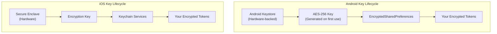

import Tabs from '@theme/Tabs';
import TabItem from '@theme/TabItem';

# The Vault Door — Part 2

> *"Encryption works. Properly implemented strong crypto systems are one of the few things that you can rely on."* — Edward Snowden

## Migrating Secrets to Secure Storage

The `TokenManager` from Chapter 1 held tokens in memory only. Now you will connect it to `SecureTokenStorage` so tokens survive app restarts without sacrificing security.

```dart title="lib/services/token_manager.dart (UPDATED)"
import 'package:fort_knox/services/secure_token_storage.dart';

class TokenManager {
  final SecureTokenStorage _storage;

  String? _accessToken;
  String? _refreshToken;
  DateTime? _expiresAt;

  TokenManager({SecureTokenStorage? storage})
      : _storage = storage ?? SecureTokenStorage();

  bool get isAuthenticated =>
      _accessToken != null &&
      _expiresAt != null &&
      DateTime.now().isBefore(_expiresAt!);

  /// Load tokens from secure storage on app startup.
  Future<void> initialise() async {
    _accessToken = await _storage.getAccessToken();
    _refreshToken = await _storage.getRefreshToken();
    if (_accessToken != null) {
      // If we got a token, it passed the expiry check in storage
      _expiresAt = DateTime.now().add(const Duration(minutes: 15));
    }
  }

  /// Save tokens to both memory and secure storage.
  Future<void> setTokens({
    required String accessToken,
    required String refreshToken,
    required Duration expiresIn,
  }) async {
    _accessToken = accessToken;
    _refreshToken = refreshToken;
    _expiresAt = DateTime.now().add(expiresIn);

    await _storage.saveTokens(
      accessToken: accessToken,
      refreshToken: refreshToken,
      expiresIn: expiresIn,
    );
  }

  String? get accessToken => isAuthenticated ? _accessToken : null;
  String? get refreshToken => _refreshToken;

  /// Clear tokens from both memory and secure storage.
  Future<void> clear() async {
    _accessToken = null;
    _refreshToken = null;
    _expiresAt = null;
    await _storage.clearTokens();
  }
}
```

Now when the user opens the app, `TokenManager.initialise()` loads any persisted tokens from the platform keychain. If the token is still valid, the user skips the login screen. If it has expired, the refresh flow kicks in automatically.

## Key Management Fundamentals

Storing tokens securely is only half the battle. You also need to think about how encryption keys are managed.



The key points:

- **You never see the encryption keys.** The platform generates, stores, and manages them in hardware-isolated containers.
- **Keys are not extractable.** Even with root/jailbreak access, the key material cannot be exported from the Keystore or Secure Enclave.
- **Keys are tied to the device.** A backup of the encrypted data is useless on another device because the key stays on the original hardware.

## What Belongs Where: The Decision Matrix

Not everything needs secure storage. Use this matrix to decide:

| Data Type | Example | Storage | Reasoning |
|---|---|---|---|
| **Auth tokens** | JWT, refresh token | `flutter_secure_storage` | Grants access to user accounts |
| **API keys** | Service credentials | Environment config / server-side | Should not exist in client at all |
| **User preferences** | Theme, language | `SharedPreferences` | Non-sensitive, no security impact |
| **Onboarding state** | Has seen tutorial | `SharedPreferences` | Non-sensitive flag |
| **Cached data** | Account balance | Encrypted database | Sensitive but not secret |
| **Biometric templates** | Fingerprint | Never stored by app | Managed by OS exclusively |
| **PII** | Name, email, sort code | Encrypted database or server | Regulatory requirements (GDPR) |
| **Session state** | Current page, scroll position | In-memory | Lost on app kill, no security impact |

:::caution API Keys Do Not Belong on the Client
If your app has an API key hardcoded or even stored in secure storage on the device, you are doing it wrong. API keys should live on your server. The client authenticates with the server using user credentials, and the server makes downstream API calls with its own keys.
:::

## Before / After Comparison
<Tabs>
<TabItem value="before" label="Before (Vulnerable)" default>

```dart title="lib/services/token_storage.dart (VULNERABLE)"
import 'package:shared_preferences/shared_preferences.dart';

class TokenStorage {
  Future<void> saveTokens({
    required String accessToken,
    required String refreshToken,
  }) async {
    final prefs = await SharedPreferences.getInstance();
    await prefs.setString('access_token', accessToken);
    await prefs.setString('refresh_token', refreshToken);
  }

  Future<String?> getAccessToken() async {
    final prefs = await SharedPreferences.getInstance();
    return prefs.getString('access_token');
  }

  Future<void> clearTokens() async {
    final prefs = await SharedPreferences.getInstance();
    await prefs.remove('access_token');
    await prefs.remove('refresh_token');
  }
}
```

**Problems:**
- Plaintext XML on Android, plist on iOS
- Readable with ADB on rooted devices
- Included in device backups
- No expiry checking
- No encryption whatsoever
</TabItem>
<TabItem value="after" label="After (Secure)">

```dart title="lib/services/secure_token_storage.dart (SECURE)"
import 'package:flutter_secure_storage/flutter_secure_storage.dart';

class SecureTokenStorage {
  static const _accessTokenKey = 'securebank_access_token';
  static const _refreshTokenKey = 'securebank_refresh_token';
  static const _tokenExpiryKey = 'securebank_token_expiry';

  final FlutterSecureStorage _storage;

  SecureTokenStorage({FlutterSecureStorage? storage})
      : _storage = storage ??
            const FlutterSecureStorage(
              aOptions: AndroidOptions(
                encryptedSharedPreferences: true,
              ),
              iOptions: IOSOptions(
                accessibility:
                    KeychainAccessibility.first_unlock_this_device,
              ),
            );

  Future<void> saveTokens({
    required String accessToken,
    required String refreshToken,
    required Duration expiresIn,
  }) async {
    final expiryTimestamp = DateTime.now()
        .add(expiresIn)
        .millisecondsSinceEpoch
        .toString();

    await Future.wait([
      _storage.write(key: _accessTokenKey, value: accessToken),
      _storage.write(key: _refreshTokenKey, value: refreshToken),
      _storage.write(key: _tokenExpiryKey, value: expiryTimestamp),
    ]);
  }

  Future<String?> getAccessToken() async {
    final expiry = await _storage.read(key: _tokenExpiryKey);
    if (expiry != null) {
      final expiryTime =
          DateTime.fromMillisecondsSinceEpoch(int.parse(expiry));
      if (DateTime.now().isAfter(expiryTime)) return null;
    }
    return _storage.read(key: _accessTokenKey);
  }

  Future<void> clearTokens() async {
    await Future.wait([
      _storage.delete(key: _accessTokenKey),
      _storage.delete(key: _refreshTokenKey),
      _storage.delete(key: _tokenExpiryKey),
    ]);
  }
}
```

**Fixed:**
- AES-256 encryption via Android Keystore
- iOS Keychain with restricted accessibility
- Expiry-checked token retrieval
- Not included in unencrypted backups
- Keys are hardware-protected and non-extractable
</TabItem>
</Tabs>

## Deep Dive

Go deeper with these resources:

- [OWASP M9: Insecure Data Storage](https://owasp.org/www-project-mobile-top-10/2023-risks/m9-insecure-data-storage) — the full risk profile for plaintext storage on mobile
- [flutter_secure_storage package](https://pub.dev/packages/flutter_secure_storage) — API reference and platform-specific configuration options
- [Apple Keychain Services documentation](https://developer.apple.com/documentation/security/keychain_services) — how iOS secures data at the hardware level
- [Android Keystore System](https://developer.android.com/privacy-and-security/keystore) — Android's hardware-backed key management system
- [OWASP Mobile Security Testing Guide: Data Storage](https://mas.owasp.org/MASTG/tests/android/MASVS-STORAGE/) — hands-on testing procedures for verifying storage security

## What's Next

Your tokens are locked in a hardware-backed vault. But what good is a vault if the courier delivering the gold is riding through bandit territory in an open cart? In **Chapter 3: Encrypted Channels**, you will enforce HTTPS, implement certificate pinning, and ensure that every byte between your app and the server travels through an encrypted tunnel that attackers cannot tap.
