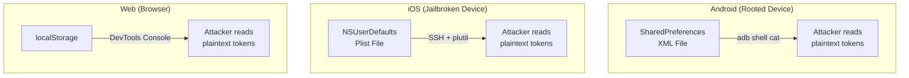

import Tabs from '@theme/Tabs';
import TabItem from '@theme/TabItem';

# Chapter 2: The Vault Door

> *"If you think cryptography is the answer to your problem, then you don't understand your problem and you don't understand cryptography."* — Peter G. Neumann

**Estimated time:** ~25 minutes | **Focus:** Data Storage | **Branch:** `chapter-2-vault-door`

---

## The Vulnerability

In Chapter 1, you moved authentication to the server and started receiving proper JWTs. But where are those tokens going? Open `lib/services/auth_service.dart` from the previous chapter and look at the storage layer:

```dart title="lib/services/auth_service.dart (VULNERABLE STORAGE)"
import 'package:shared_preferences/shared_preferences.dart';

class TokenStorage {
  Future<void> saveTokens({
    required String accessToken,
    required String refreshToken,
  }) async {
    final prefs = await SharedPreferences.getInstance();
    // FLAW: Tokens stored in plaintext
    await prefs.setString('access_token', accessToken);
    await prefs.setString('refresh_token', refreshToken);
  }

  Future<String?> getAccessToken() async {
    final prefs = await SharedPreferences.getInstance();
    return prefs.getString('access_token');
  }

  Future<String?> getRefreshToken() async {
    final prefs = await SharedPreferences.getInstance();
    return prefs.getString('refresh_token');
  }

  Future<void> clearTokens() async {
    final prefs = await SharedPreferences.getInstance();
    await prefs.remove('access_token');
    await prefs.remove('refresh_token');
  }
}
```

This looks clean. It uses proper method names. It separates concerns. And it is completely insecure.

## Why SharedPreferences Is Not Secure

SharedPreferences on each platform stores data as plaintext:

- **Android:** XML files in `/data/data/<package>/shared_prefs/`
- **iOS:** Plist files in the app sandbox
- **Web:** `localStorage` in the browser



On a rooted Android device, reading SharedPreferences takes one command:

```bash title="Terminal (attacker's machine)"
adb shell cat /data/data/com.securebank.app/shared_prefs/FlutterSharedPreferences.xml
```

The output is plaintext XML containing every key-value pair your app has stored, including authentication tokens, API keys, and any other secrets you carelessly placed there.

:::caution SharedPreferences Is for Preferences
SharedPreferences is designed for non-sensitive user preferences: theme selection, onboarding completion flags, language settings. It was never intended for secrets. Treat it the same way you would treat a sticky note on your monitor.
:::

## The Secure Alternative: flutter_secure_storage

The `flutter_secure_storage` package wraps the platform-native secure storage mechanisms:

| Platform | Backing Store | Encryption |
|---|---|---|
| **Android** | EncryptedSharedPreferences (API 23+) | AES-256 via Android Keystore |
| **iOS** | Keychain Services | Hardware-backed encryption |
| **macOS** | Keychain Services | Hardware-backed encryption |
| **Web** | Not recommended for secrets | — |

### Setup

Add the dependency:

```yaml title="pubspec.yaml"
dependencies:
  flutter_secure_storage: ^9.2.0
```

For Android, update the minimum SDK version:

```groovy title="android/app/build.gradle"
android {
    defaultConfig {
        minSdkVersion 23 // Required for EncryptedSharedPreferences
    }
}
```

:::info Android Configuration
On Android 6.0+ (API 23), `flutter_secure_storage` uses `EncryptedSharedPreferences` with keys stored in the Android Keystore. The Keystore is a hardware-backed (on supported devices) or TEE-backed container that prevents key extraction even on rooted devices.
:::

### The Secure Token Storage Implementation

```dart title="lib/services/secure_token_storage.dart"
import 'package:flutter_secure_storage/flutter_secure_storage.dart';

class SecureTokenStorage {
  static const _accessTokenKey = 'securebank_access_token';
  static const _refreshTokenKey = 'securebank_refresh_token';
  static const _tokenExpiryKey = 'securebank_token_expiry';

  final FlutterSecureStorage _storage;

  SecureTokenStorage({FlutterSecureStorage? storage})
      : _storage = storage ??
            const FlutterSecureStorage(
              aOptions: AndroidOptions(
                encryptedSharedPreferences: true,
              ),
              iOptions: IOSOptions(
                accessibility: KeychainAccessibility.first_unlock_this_device,
              ),
            );

  Future<void> saveTokens({
    required String accessToken,
    required String refreshToken,
    required Duration expiresIn,
  }) async {
    final expiryTimestamp = DateTime.now()
        .add(expiresIn)
        .millisecondsSinceEpoch
        .toString();

    await Future.wait([
      _storage.write(key: _accessTokenKey, value: accessToken),
      _storage.write(key: _refreshTokenKey, value: refreshToken),
      _storage.write(key: _tokenExpiryKey, value: expiryTimestamp),
    ]);
  }

  Future<String?> getAccessToken() async {
    final expiry = await _storage.read(key: _tokenExpiryKey);
    if (expiry != null) {
      final expiryTime =
          DateTime.fromMillisecondsSinceEpoch(int.parse(expiry));
      if (DateTime.now().isAfter(expiryTime)) {
        // Token has expired — don't return it
        return null;
      }
    }
    return _storage.read(key: _accessTokenKey);
  }

  Future<String?> getRefreshToken() async {
    return _storage.read(key: _refreshTokenKey);
  }

  Future<void> clearTokens() async {
    await Future.wait([
      _storage.delete(key: _accessTokenKey),
      _storage.delete(key: _refreshTokenKey),
      _storage.delete(key: _tokenExpiryKey),
    ]);
  }

  Future<bool> hasValidToken() async {
    final token = await getAccessToken();
    return token != null;
  }
}
```

Key decisions in this implementation:

1. **`encryptedSharedPreferences: true`** — Uses the Android Keystore-backed encryption rather than the older AES-CBC approach.

2. **`KeychainAccessibility.first_unlock_this_device`** — On iOS, tokens are available after the first device unlock but are not included in backups. This prevents token extraction from iTunes/iCloud backups.

3. **Expiry checking at read time** — The `getAccessToken()` method checks the expiry timestamp and returns `null` for expired tokens, forcing a refresh flow.

4. **`Future.wait` for parallel writes** — Writing multiple keys in parallel is safe and faster than sequential writes.

:::tip iOS Keychain Accessibility Levels
Choose the right accessibility level for your data:
- `first_unlock_this_device` — Available after first unlock, not backed up (best for auth tokens)
- `when_unlocked` — Only while device is unlocked (best for highly sensitive data)
- `always` — Always available, included in backups (avoid for secrets)
:::

In Part 2, you will migrate the rest of the app's secrets to secure storage and build a decision matrix for choosing the right storage mechanism.
