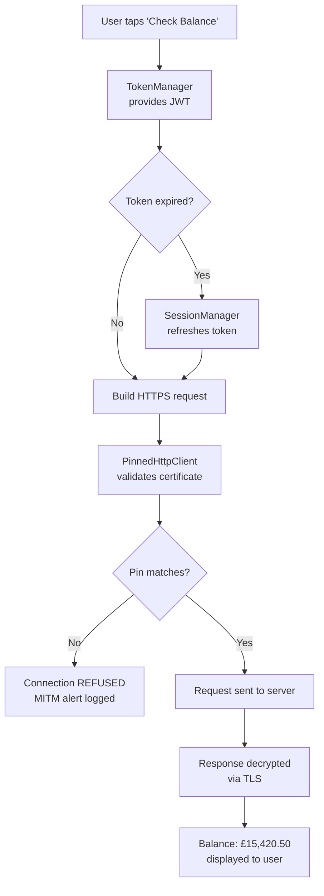

import Tabs from '@theme/Tabs';
import TabItem from '@theme/TabItem';

# Encrypted Channels — Part 2

> *"The castle walls mean nothing if the messenger rides through enemy territory with an unsealed letter."* — Medieval military proverb

## Handling Pin Failures Gracefully

When certificate pinning fails, your app must refuse the connection. But it should also tell the user something useful without revealing security internals to a potential attacker.

```dart title="lib/services/network_error_handler.dart"
import 'dart:io';
import 'dart:developer' as developer;

class NetworkErrorHandler {
  /// Translate network exceptions into user-friendly messages.
  /// Never expose technical details about pinning failures to the UI.
  static String handleError(Object error) {
    if (error is HandshakeException) {
      // Certificate pinning failure or TLS handshake issue
      developer.log(
        'TLS handshake failed: $error',
        name: 'NetworkSecurity',
        level: 1000, // Severe
      );
      return 'Secure connection could not be established. '
          'Please check your network connection and try again.';
    }

    if (error is SocketException) {
      return 'Unable to reach the server. '
          'Please check your internet connection.';
    }

    if (error is HttpException) {
      return 'Server communication error. Please try again.';
    }

    developer.log(
      'Unexpected network error: $error',
      name: 'NetworkSecurity',
    );
    return 'Something went wrong. Please try again later.';
  }

  /// Determine if a network error might indicate a MITM attack.
  /// If so, log aggressively and consider alerting your backend.
  static bool isPossibleMitmAttack(Object error) {
    if (error is HandshakeException) {
      final message = error.toString().toLowerCase();
      return message.contains('certificate') ||
          message.contains('handshake') ||
          message.contains('trust');
    }
    return false;
  }
}
```

:::caution Do Not Reveal Pin Details
Never show the user a message like "Certificate pin mismatch: expected sha256/YLh1..." This tells an attacker exactly what your pins are and how close their forged certificate is to passing. Keep error messages generic for the user and detailed in your server-side logs.
:::

## Android Network Security Config

Android provides a declarative way to enforce HTTPS and configure certificate pinning at the OS level. This applies to all network traffic from your app, including third-party libraries.

```xml title="android/app/src/main/res/xml/network_security_config.xml"
<?xml version="1.0" encoding="utf-8"?>
<network-security-config>
    <!-- Block all cleartext (HTTP) traffic by default -->
    <base-config cleartextTrafficPermitted="false">
        <trust-anchors>
            <certificates src="system" />
        </trust-anchors>
    </base-config>

    <!-- Pin certificates for your API domain -->
    <domain-config>
        <domain includeSubdomains="true">api.fortknox.co.uk</domain>
        <pin-set expiration="2025-06-01">
            <!-- Current key -->
            <pin digest="SHA-256">YLh1dUR9y6Kja30RrAn7JKnbQG/uEtLMkBgFF2Fuihg=</pin>
            <!-- Backup key -->
            <pin digest="SHA-256">sRHdihwgkaib1P1gN7akTYPbRMmOG2QGnBPMpaft3eE=</pin>
        </pin-set>
    </domain-config>

    <!-- Allow cleartext ONLY for local development -->
    <domain-config cleartextTrafficPermitted="true">
        <domain>10.0.2.2</domain>  <!-- Android emulator localhost -->
        <domain>localhost</domain>
    </domain-config>
</network-security-config>
```

Reference this config in your `AndroidManifest.xml`:

```xml title="android/app/src/main/AndroidManifest.xml"
<application
    android:networkSecurityConfig="@xml/network_security_config"
    ...>
```

:::info Pin Expiry
The `expiration` attribute on `<pin-set>` is a safety valve. After the expiry date, the pins are ignored and standard CA validation resumes. This prevents your app from becoming permanently bricked if you lose control of your key pair. Set the expiry to match your certificate renewal cycle, then ship an app update with new pins before it expires.
:::

## iOS App Transport Security (ATS)

iOS enforces HTTPS by default through App Transport Security. You should explicitly verify your `Info.plist` does not weaken it:

```xml title="ios/Runner/Info.plist"
<key>NSAppTransportSecurity</key>
<dict>
    <!-- DO NOT set NSAllowsArbitraryLoads to true -->

    <!-- Allow localhost for development only -->
    <key>NSExceptionDomains</key>
    <dict>
        <key>localhost</key>
        <dict>
            <key>NSExceptionAllowsInsecureHTTPLoads</key>
            <true/>
            <key>NSIncludesSubdomains</key>
            <false/>
        </dict>
    </dict>
</dict>
```

:::caution The NSAllowsArbitraryLoads Trap
Many Flutter tutorials tell you to set `NSAllowsArbitraryLoads` to `true` to "fix" network issues during development. This disables ATS entirely, allowing HTTP traffic to any domain. Apple reviews apps for this setting, and banking apps with it enabled will be rejected. Keep it disabled and use domain-specific exceptions only for localhost development.
:::

## Wiring It All Together

Here is how the `SessionManager` from Chapter 1 now creates the pinned client:

```dart title="lib/services/session_manager.dart (UPDATED)"
class SessionManager {
  final String _baseUrl;
  final http.Client _client;
  final TokenManager _tokenManager;

  SessionManager({
    required String baseUrl,
    required TokenManager tokenManager,
    http.Client? client,
  })  : _baseUrl = baseUrl,
        _tokenManager = tokenManager,
        // Use pinned client by default
        _client = client ?? PinnedHttpClient.create();

  Future<http.Response> authenticatedRequest(
    String method,
    String path, {
    Map<String, String>? headers,
    String? body,
  }) async {
    try {
      var response = await _makeRequest(method, path,
          headers: headers, body: body);

      if (response.statusCode == 401) {
        final refreshed = await refreshSession();
        if (refreshed) {
          response = await _makeRequest(method, path,
              headers: headers, body: body);
        }
      }

      return response;
    } on HandshakeException catch (e) {
      if (NetworkErrorHandler.isPossibleMitmAttack(e)) {
        // In production, report this to your security monitoring service
        developer.log(
          'POSSIBLE MITM ATTACK DETECTED on $path',
          name: 'SecurityAlert',
          level: 2000,
        );
      }
      rethrow;
    }
  }

  // ... rest of the implementation from Chapter 1
}
```

## Before / After Comparison
<Tabs>
<TabItem value="before" label="Before (Vulnerable)" default>

```dart title="lib/services/api_service.dart (VULNERABLE)"
class ApiService {
  static const String baseUrl = 'http://api.fortknox.co.uk';

  Future<Map<String, dynamic>> getBalance(String accountId) async {
    final response = await http.get(
      Uri.parse('$baseUrl/accounts/$accountId/balance'),
      headers: {'Authorization': 'Bearer static_token_abc123'},
    );
    return jsonDecode(response.body);
  }

  Future<Map<String, dynamic>> transfer({
    required String fromAccount,
    required String toAccount,
    required double amount,
  }) async {
    final response = await http.post(
      Uri.parse('$baseUrl/transfer'),
      body: jsonEncode({
        'from': fromAccount,
        'to': toAccount,
        'amount': amount,
        'currency': 'GBP',
      }),
    );
    return jsonDecode(response.body);
  }
}
```

**Problems:**
- HTTP — all traffic in plaintext
- No certificate validation beyond OS defaults
- Vulnerable to MITM on any network
- No cleartext traffic blocking
- No Android Network Security Config
- ATS likely disabled with `NSAllowsArbitraryLoads`
</TabItem>
<TabItem value="after" label="After (Secure)">

```dart title="lib/services/api_service.dart (SECURE)"
class ApiService {
  final SessionManager _session;

  ApiService({required SessionManager session}) : _session = session;

  Future<Map<String, dynamic>> getBalance(String accountId) async {
    try {
      final response = await _session.authenticatedRequest(
        'GET',
        '/accounts/$accountId/balance',
      );
      if (response.statusCode == 200) {
        return jsonDecode(response.body);
      }
      throw ApiException('Failed to fetch balance');
    } catch (e) {
      if (e is ApiException) rethrow;
      throw ApiException(NetworkErrorHandler.handleError(e));
    }
  }

  Future<Map<String, dynamic>> transfer({
    required String fromAccount,
    required String toAccount,
    required double amount,
  }) async {
    if (amount <= 0 || amount > 50000) {
      throw ApiException('Invalid transfer amount');
    }

    try {
      final response = await _session.authenticatedRequest(
        'POST',
        '/transfer',
        body: jsonEncode({
          'from': fromAccount,
          'to': toAccount,
          'amount': amount,
          'currency': 'GBP',
        }),
      );
      if (response.statusCode == 200) {
        return jsonDecode(response.body);
      }
      throw ApiException('Transfer failed');
    } catch (e) {
      if (e is ApiException) rethrow;
      throw ApiException(NetworkErrorHandler.handleError(e));
    }
  }
}
```

**Fixed:**
- HTTPS enforced at code and OS level
- Certificate pinning with backup pins
- Android Network Security Config blocks cleartext
- iOS ATS properly configured
- MITM detection with security logging
- Graceful error handling for pin failures
- Transfer amount validation
</TabItem>
</Tabs>

## The Complete Security Stack So Far

After three chapters, here is what your network request lifecycle looks like:



Every layer protects the next. Tokens are encrypted at rest (Chapter 2), transported over pinned HTTPS (Chapter 3), and managed with automatic rotation (Chapter 1).

## Deep Dive

Expand your understanding with these resources:

- [OWASP M5: Insecure Communication](https://owasp.org/www-project-mobile-top-10/2023-risks/m5-insecure-communication) — the full risk profile for unencrypted and poorly secured network traffic
- [OWASP Certificate Pinning Cheat Sheet](https://cheatsheetseries.owasp.org/cheatsheets/Pinning_Cheat_Sheet.html) — comprehensive guide to certificate and public key pinning strategies
- [Android Network Security Configuration](https://developer.android.com/privacy-and-security/security-config) — declarative network security policy for Android apps
- [Apple App Transport Security](https://developer.apple.com/documentation/bundleresources/information-property-list/nsapptransportsecurity) — how iOS enforces HTTPS and TLS requirements
- [SSL Labs Server Test](https://www.ssllabs.com/ssltest/) — test your server's TLS configuration for vulnerabilities and best practices

## What's Next

Your data is now encrypted at rest and in transit. But what about the data itself? In **Chapter 4: Payload**, you will implement end-to-end encryption for sensitive transaction payloads, ensuring that even if an attacker somehow compromises your server, the raw financial data remains unreadable.
