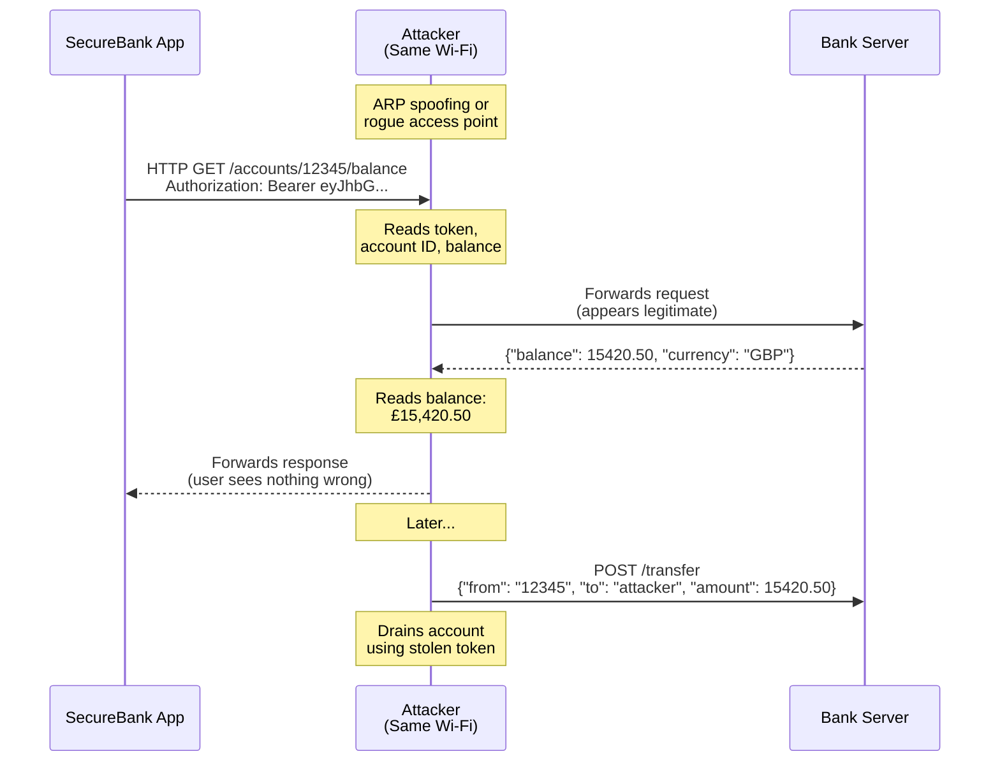
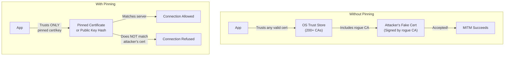

import Tabs from '@theme/Tabs';
import TabItem from '@theme/TabItem';

# Chapter 3: Encrypted Channels

> *"The enemy knows the system. Security must reside in the key, not in the secrecy of the algorithm."* — Auguste Kerckhoffs, 1883

**Estimated time:** ~30 minutes | **Focus:** Network Layer | **Branch:** `chapter-3-encrypted-channels`

---

## The Vulnerability

Open `lib/services/api_service.dart` and examine the network layer:

```dart title="lib/services/api_service.dart (VULNERABLE)"
import 'dart:convert';
import 'package:http/http.dart' as http;

class ApiService {
  // FLAW 1: HTTP instead of HTTPS
  static const String baseUrl = 'http://api.securebank.co.uk';

  Future<Map<String, dynamic>> getBalance(String accountId) async {
    final response = await http.get(
      Uri.parse('$baseUrl/accounts/$accountId/balance'),
      headers: {
        // FLAW 2: Hardcoded token (fixed in Ch 1, but the transport is still open)
        'Authorization': 'Bearer static_token_abc123',
      },
    );
    return jsonDecode(response.body);
  }

  Future<Map<String, dynamic>> transfer({
    required String fromAccount,
    required String toAccount,
    required double amount,
  }) async {
    final response = await http.post(
      Uri.parse('$baseUrl/transfer'),
      headers: {'Content-Type': 'application/json'},
      body: jsonEncode({
        'from': fromAccount,
        'to': toAccount,
        'amount': amount,
        'currency': 'GBP',
      }),
    );
    return jsonDecode(response.body);
  }
}
```

Two critical flaws: the app communicates over unencrypted HTTP, and it does no certificate validation beyond the OS default. Even after switching to HTTPS, without certificate pinning, an attacker with a rogue CA certificate installed on the device can still intercept traffic.

## How a MITM Attack Works

A Man-in-the-Middle attack intercepts the communication between your app and the server. Here is how it plays out on a coffee-shop Wi-Fi network:



Over HTTP, every byte is plaintext. The attacker sees authentication tokens, account numbers, balances, and transaction details. They can also modify requests in transit, changing transfer recipients or amounts.

## Fix 1: Enforce HTTPS

The most basic fix is to change `http://` to `https://`. But you should also ensure your app refuses to make any HTTP calls at all.

```dart title="lib/services/api_config.dart"
class ApiConfig {
  // Always HTTPS — no exceptions
  static const String baseUrl = 'https://api.securebank.co.uk';

  /// Validate that a URL uses HTTPS before making a request.
  static Uri validateAndParse(String path) {
    final uri = Uri.parse('$baseUrl$path');
    if (uri.scheme != 'https') {
      throw SecurityException(
        'Insecure URL scheme: ${uri.scheme}. Only HTTPS is permitted.',
      );
    }
    return uri;
  }
}

class SecurityException implements Exception {
  final String message;
  SecurityException(this.message);

  @override
  String toString() => 'SecurityException: $message';
}
```

:::info HTTPS Is Necessary but Not Sufficient
HTTPS encrypts traffic using TLS, which prevents passive eavesdropping. However, it does not prevent an attacker who has installed a rogue Certificate Authority on the device. For that, you need certificate pinning, which we cover next.
:::

## Certificate Pinning: The Concept

When your app connects to `https://api.securebank.co.uk`, the server presents a TLS certificate. By default, the OS verifies this certificate against its trust store of Certificate Authorities (CAs). The problem is that the trust store can be modified:

- Corporate proxies install their own CA certificates
- Attackers on rooted/jailbroken devices can add CAs
- Compromised CAs can issue fraudulent certificates

Certificate pinning tells your app: "I only trust **this specific certificate** (or certificates signed by **this specific CA**), regardless of what the device trust store says."



There are two pinning strategies:

| Strategy | What You Pin | Pros | Cons |
|---|---|---|---|
| **Certificate pinning** | The full leaf certificate | Simple to implement | Must update app when cert rotates |
| **Public key pinning** | The Subject Public Key Info (SPKI) hash | Survives cert renewal if key stays same | Slightly more complex |

For production apps, **public key pinning** is preferred because certificates rotate regularly (often every 90 days with Let's Encrypt), but the underlying key pair can remain stable across renewals.

## Implementing a Pinned HTTP Client

You will use the `http_certificate_pinning` approach with Dart's `HttpClient` and `SecurityContext`:

```dart title="lib/services/pinned_http_client.dart"
import 'dart:io';
import 'dart:convert';
import 'dart:developer' as developer;
import 'package:http/http.dart' as http;
import 'package:http/io_client.dart';

class PinnedHttpClient {
  /// SHA-256 fingerprints of the server's public key.
  /// Include current AND next key for rotation.
  static const List<String> _pinnedKeyHashes = [
    // Current key
    'sha256/YLh1dUR9y6Kja30RrAn7JKnbQG/uEtLMkBgFF2Fuihg=',
    // Backup key (for rotation)
    'sha256/sRHdihwgkaib1P1gN7akTYPbRMmOG2QGnBPMpaft3eE=',
  ];

  /// Create an HTTP client that validates the server's certificate
  /// against pinned public key hashes.
  static http.Client create() {
    final httpClient = HttpClient();

    httpClient.badCertificateCallback =
        (X509Certificate cert, String host, int port) {
      // Never accept bad certificates
      developer.log(
        'Certificate validation failed for $host:$port',
        name: 'PinnedHttpClient',
      );
      return false;
    };

    return IOClient(httpClient);
  }

  /// Verify the certificate's public key hash against our pins.
  /// Call this after the TLS handshake in a custom SecurityContext.
  static bool verifyCertificatePin(X509Certificate certificate) {
    final certHash = _computeSha256Fingerprint(certificate);
    final isPinned = _pinnedKeyHashes.contains(certHash);

    if (!isPinned) {
      developer.log(
        'Certificate pin mismatch! Expected one of: $_pinnedKeyHashes, '
        'got: $certHash',
        name: 'PinnedHttpClient',
      );
    }

    return isPinned;
  }

  static String _computeSha256Fingerprint(X509Certificate certificate) {
    // In production, compute the SPKI hash from the certificate's
    // DER-encoded public key using package:crypto
    // This is a simplified representation
    final der = certificate.der;
    final digest = _sha256(der);
    return 'sha256/${base64.encode(digest)}';
  }

  // Placeholder — use package:crypto in production
  static List<int> _sha256(List<int> data) {
    // Use: import 'package:crypto/crypto.dart';
    // return crypto.sha256.convert(data).bytes;
    throw UnimplementedError('Use package:crypto for SHA-256');
  }
}
```

:::tip Why Two Pins?
Always pin at least two keys: the current one and a backup. If you only pin one key and your server's certificate changes unexpectedly, every installed copy of your app will stop working. The backup pin gives you a safe rotation path. Generate the backup key pair now, store it securely, and you will be ready when rotation day comes.
:::

## Using the Pinned Client in ApiService

Replace the default `http.Client` with the pinned client:

```dart title="lib/services/api_service.dart (SECURE)"
import 'dart:convert';
import 'package:http/http.dart' as http;
import 'package:fort_knox/services/api_config.dart';
import 'package:fort_knox/services/pinned_http_client.dart';
import 'package:fort_knox/services/session_manager.dart';

class ApiService {
  final SessionManager _session;

  ApiService({required SessionManager session}) : _session = session;

  Future<Map<String, dynamic>> getBalance(String accountId) async {
    final response = await _session.authenticatedRequest(
      'GET',
      '/accounts/$accountId/balance',
    );

    if (response.statusCode == 200) {
      return jsonDecode(response.body);
    }
    throw ApiException('Failed to fetch balance: ${response.statusCode}');
  }

  Future<Map<String, dynamic>> transfer({
    required String fromAccount,
    required String toAccount,
    required double amount,
  }) async {
    // Validate amount before sending
    if (amount <= 0) {
      throw ApiException('Transfer amount must be positive');
    }
    if (amount > 50000) {
      throw ApiException('Transfer exceeds single transaction limit (£50,000)');
    }

    final response = await _session.authenticatedRequest(
      'POST',
      '/transfer',
      body: jsonEncode({
        'from': fromAccount,
        'to': toAccount,
        'amount': amount,
        'currency': 'GBP',
      }),
    );

    if (response.statusCode == 200) {
      return jsonDecode(response.body);
    }
    throw ApiException('Transfer failed: ${response.statusCode}');
  }
}

class ApiException implements Exception {
  final String message;
  ApiException(this.message);

  @override
  String toString() => 'ApiException: $message';
}
```

Notice the key changes:
- The `http.Client` is no longer created directly — it comes through the `SessionManager`, which uses the pinned client
- All requests go through `authenticatedRequest`, which handles token injection and refresh
- The base URL is centralised in `ApiConfig` with HTTPS enforcement
- Basic input validation is now in place for transfers

In Part 2, you will handle pin failures gracefully, configure Android's Network Security Config, set up iOS App Transport Security, and see the full before/after comparison.
