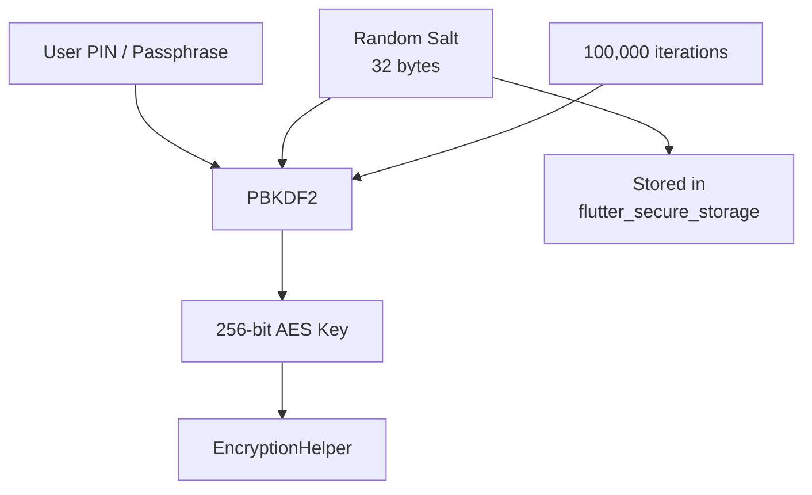

import Tabs from '@theme/Tabs';
import TabItem from '@theme/TabItem';

# Part 2: Forging the Key

> *"The strength of a lock is not in the door, but in the key that turns it."*

---

## Key Derivation with PBKDF2

In Part 1 you encrypted data with AES-256-GCM, but the key was a raw `Uint8List` passed directly. In production, you never want a hardcoded key. Instead, you **derive** a key from a user secret (their PIN or passphrase) using a Key Derivation Function.

**PBKDF2** (Password-Based Key Derivation Function 2) is the right tool here:

| Parameter | Recommended Value | Purpose |
|-----------|-------------------|---------|
| Hash function | SHA-256 | Underlying hash for HMAC |
| Iterations | 100,000+ | Slows brute-force attacks |
| Salt | 32 random bytes | Prevents rainbow-table attacks |
| Output length | 32 bytes (256 bits) | Matches AES-256 key size |



:::caution Never Hardcode Keys
A key embedded in source code or committed to version control can be extracted by decompiling the APK/IPA. PBKDF2 derives the key at runtime from a secret the user provides, so the key never exists in the binary.
:::

---

## The EncryptionService

Wrap key derivation, salt management, and the `EncryptionHelper` into a single service:

```dart title="lib/data/encryption/encryption_service.dart"
import 'dart:convert';
import 'dart:math';
import 'dart:typed_data';
import 'package:crypto/crypto.dart';
import 'package:flutter_secure_storage/flutter_secure_storage.dart';
import 'encryption_helper.dart';

class EncryptionService {
  static const _saltKey = 'securebank_pbkdf2_salt';
  static const _iterations = 100000;
  static const _keyLength = 32; // 256 bits

  final FlutterSecureStorage _secureStorage;
  EncryptionHelper? _helper;

  EncryptionService({FlutterSecureStorage? secureStorage})
      : _secureStorage = secureStorage ?? const FlutterSecureStorage();

  /// Initialise the service with the user's PIN or passphrase.
  /// Call this once after authentication succeeds.
  Future<void> initialise(String userSecret) async {
    final salt = await _getOrCreateSalt();
    final keyBytes = _deriveKey(userSecret, salt);
    _helper = EncryptionHelper(keyBytes);
  }

  EncryptionHelper get helper {
    if (_helper == null) {
      throw StateError(
        'EncryptionService not initialised. Call initialise() first.',
      );
    }
    return _helper!;
  }

  /// Retrieve persisted salt, or generate and store a new one.
  Future<Uint8List> _getOrCreateSalt() async {
    final existing = await _secureStorage.read(key: _saltKey);
    if (existing != null) {
      return base64Decode(existing);
    }

    final salt = Uint8List(_keyLength);
    final random = Random.secure();
    for (var i = 0; i < salt.length; i++) {
      salt[i] = random.nextInt(256);
    }

    await _secureStorage.write(
      key: _saltKey,
      value: base64Encode(salt),
    );
    return salt;
  }

  /// PBKDF2 key derivation using dart:crypto HMAC-SHA256.
  Uint8List _deriveKey(String passphrase, Uint8List salt) {
    final hmac = Hmac(sha256, utf8.encode(passphrase));
    final blocks = <int>[];
    final numBlocks = (_keyLength / sha256.blockSize).ceil().clamp(1, 256);

    for (var blockIndex = 1; blockIndex <= numBlocks; blockIndex++) {
      final blockBytes = ByteData(4)..setUint32(0, blockIndex, Endian.big);
      var u = hmac
          .convert([...salt, ...blockBytes.buffer.asUint8List()])
          .bytes;
      var result = List<int>.from(u);

      for (var i = 1; i < _iterations; i++) {
        u = hmac.convert(u).bytes;
        for (var j = 0; j < result.length; j++) {
          result[j] ^= u[j];
        }
      }
      blocks.addAll(result);
    }

    return Uint8List.fromList(blocks.sublist(0, _keyLength));
  }

  /// Wipe key material from memory on logout.
  void dispose() {
    _helper = null;
  }
}
```

:::tip Salt Storage
The salt is stored in `flutter_secure_storage`, which uses the Android Keystore and iOS Keychain under the hood. This means the salt is protected by the OS-level secure enclave -- far more resilient than SharedPreferences or a file on disk.
:::

---

## Wiring It Into the App

Register the service early in the app lifecycle and initialise it after the user authenticates:

```dart title="lib/main.dart (excerpt)"
final encryptionService = EncryptionService();

// After successful login:
await encryptionService.initialise(userPin);

// Provide to repositories:
final transactionRepo = TransactionRepository(
  database,
  encryptionService.helper,
);
```

On logout, wipe the key material:

```dart title="lib/features/auth/auth_controller.dart (excerpt)"
Future<void> logout() async {
  encryptionService.dispose();
  await authService.signOut();
}
```

---

## Encrypting Drift Columns: Before and After
<Tabs>
<TabItem value="before" label="Before (Vulnerable)">

```dart title="transaction_repository.dart — INSECURE"
Future<void> insertTransaction({
  required String recipientName,
  required String recipientAccount,
  required double amount,
  required String reference,
}) async {
  await _db.into(_db.transactions).insert(
    TransactionsCompanion.insert(
      recipientName: recipientName,
      recipientAccount: recipientAccount,  // Plaintext!
      amount: amount,
      reference: reference,                 // Plaintext!
      createdAt: DateTime.now(),
    ),
  );
}
```

**Database extraction yields:**
```
Alice Johnson | GB29 NWBK 6016 1331 9268 19 | Rent payment March
```
</TabItem>
<TabItem value="after" label="After (Hardened)">

```dart title="transaction_repository.dart — SECURE"
Future<void> insertTransaction({
  required String recipientName,
  required String recipientAccount,
  required double amount,
  required String reference,
}) async {
  await _db.into(_db.transactions).insert(
    TransactionsCompanion.insert(
      recipientName: recipientName,
      recipientAccount: _encryption.encryptText(recipientAccount),
      amount: amount,
      reference: _encryption.encryptText(reference),
      createdAt: DateTime.now(),
    ),
  );
}
```

**Database extraction yields:**
```
Alice Johnson | ZjQ5MjFhNmY4YzJk...== | NWEzODRiY2UxZTdm...==
```
</TabItem>
</Tabs>

---

## Deep Dive

Expand your understanding of data-at-rest encryption with these resources:

- [OWASP Mobile Top 10 — M9: Insecure Data Storage](https://owasp.org/www-project-mobile-top-10/) -- The definitive catalogue of mobile data storage vulnerabilities and mitigations.
- [AES-256-GCM Explained](https://en.wikipedia.org/wiki/Galois/Counter_Mode) -- How Galois/Counter Mode provides authenticated encryption in a single pass.
- [PBKDF2 — RFC 8018](https://datatracker.ietf.org/doc/html/rfc8018#section-5.2) -- The formal specification for password-based key derivation.
- [Flutter Secure Storage Documentation](https://pub.dev/packages/flutter_secure_storage) -- Platform-specific details on Keystore (Android) and Keychain (iOS) integration.
- [NIST SP 800-132: Password-Based Key Derivation](https://csrc.nist.gov/publications/detail/sp/800-132/final) -- NIST recommendations for iteration counts, salt lengths, and key sizes.

---

## What's Next

Your data is now encrypted at rest, but anyone who opens the app can still navigate to any screen -- including admin views. In **Chapter 5: Need to Know**, you will implement role-based access control with GoRouter redirect guards to ensure users can only reach the screens their role permits.
