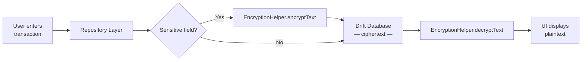

# Chapter 4: Guarding the Payload

> *"A fortress is only as strong as the weakest lock on its treasury."* — Security proverb

**Estimated time:** ~25 minutes | **Focus:** Data Encryption at Rest | **Branch:** `chapter-4-payload`

---

## What You Will Learn

- Why plaintext data in a local database is a critical vulnerability
- How device theft or backup extraction exposes user financial data
- How to encrypt sensitive columns in Drift using AES-256
- How to integrate the `encrypt` package into a Flutter banking app

---

## The Vulnerability: Plaintext Treasure

Open SecureBank and look at how transactions are stored. If you inspect the Drift database definition, you will find something alarming:

```dart title="lib/data/database/tables.dart"
class Transactions extends Table {
  IntColumn get id => integer().autoIncrement()();
  TextColumn get recipientName => text()();
  TextColumn get recipientAccount => text()();   // "GB29 NWBK 6016 1331 9268 19"
  RealColumn get amount => real()();              // 2500.00
  TextColumn get currency => text().withDefault(const Constant('GBP'))();
  TextColumn get reference => text()();           // "Rent payment March"
  DateTimeColumn get createdAt => dateTime()();
}
```

Every field is stored as **plaintext** in a SQLite file on the device. Recipient account numbers, transfer amounts, payment references -- all of it sitting in the clear.

### Why This Matters

You might think: "The device has a lock screen. Surely that is enough?" It is not. Consider these attack vectors:

1. **Device theft** -- An attacker with physical access can extract the SQLite file from an unencrypted backup or a rooted device.
2. **ADB backup extraction** -- On Android, `adb backup` can pull app data if backup is not explicitly disabled.
3. **iCloud / Google Drive backups** -- If the database file is included in cloud backups, anyone who compromises the cloud account gets the data.
4. **Forensic tools** -- Commercial tools like Cellebrite can extract app databases even from locked devices.

:::caution Real-World Impact
In 2019, a major UK challenger bank stored transaction data in plaintext on-device. After a coordinated phone-theft ring targeted London commuters, stolen devices yielded complete financial histories -- account numbers, balances, and payee details -- without needing to unlock the app.
:::

### Seeing the Problem

You can verify this yourself. Run SecureBank on an emulator, create a few transactions, then pull the database:

```bash title="Extracting the database (Android emulator)"
adb root
adb pull /data/data/com.securebank.app/databases/securebank.db ./
sqlite3 securebank.db "SELECT recipientName, recipientAccount, amount FROM transactions;"
```

The output is devastating:

```
Alice Johnson|GB29 NWBK 6016 1331 9268 19|2500.0
Bob Smith|GB76 BARC 2006 0513 6878 00|750.0
HMRC|GB03 BARC 2000 0000 1372 51|1842.5
```

Every transaction, in full, readable by anyone.

---

## The Fix: AES Encryption at Rest

The solution is to encrypt sensitive data before it reaches the database. Even if an attacker extracts the SQLite file, they get ciphertext -- useless without the key.

### Choosing the Right Algorithm

For symmetric encryption at rest, **AES-256-GCM** is the industry standard:

| Property | Value |
|----------|-------|
| Algorithm | AES (Advanced Encryption Standard) |
| Key size | 256 bits |
| Mode | GCM (Galois/Counter Mode) |
| Provides | Confidentiality + integrity + authenticity |

GCM mode is critical because it is an **authenticated encryption** mode. It does not just hide the data -- it detects tampering. If an attacker modifies the ciphertext, decryption fails rather than producing corrupted plaintext.

### Adding the encrypt Package

Add the dependency to your project:

```yaml title="pubspec.yaml"
dependencies:
  encrypt: ^5.0.3
```

### Building the EncryptionHelper

Start with a focused helper that wraps AES-GCM operations:

```dart title="lib/data/encryption/encryption_helper.dart"
import 'dart:convert';
import 'dart:typed_data';
import 'package:encrypt/encrypt.dart' as encrypt;

class EncryptionHelper {
  final encrypt.Key _key;

  EncryptionHelper(Uint8List keyBytes)
      : _key = encrypt.Key(keyBytes);

  /// Encrypts [plaintext] and returns a Base64 string
  /// containing the IV prepended to the ciphertext.
  String encryptText(String plaintext) {
    final iv = encrypt.IV.fromSecureRandom(12); // 96-bit IV for GCM
    final encrypter = encrypt.Encrypter(
      encrypt.AES(_key, mode: encrypt.AESMode.gcm),
    );
    final encrypted = encrypter.encrypt(plaintext, iv: iv);

    // Prepend IV so we can extract it during decryption
    final combined = iv.bytes + encrypted.bytes;
    return base64Encode(combined);
  }

  /// Decrypts a Base64 string produced by [encryptText].
  String decryptText(String cipherBase64) {
    final combined = base64Decode(cipherBase64);
    final ivBytes = combined.sublist(0, 12);
    final cipherBytes = combined.sublist(12);

    final iv = encrypt.IV(Uint8List.fromList(ivBytes));
    final encrypter = encrypt.Encrypter(
      encrypt.AES(_key, mode: encrypt.AESMode.gcm),
    );
    return encrypter.decrypt(
      encrypt.Encrypted(Uint8List.fromList(cipherBytes)),
      iv: iv,
    );
  }
}
```

:::tip Why Prepend the IV?
The **Initialisation Vector** (IV) is not secret -- it just must be unique per encryption operation. Prepending it to the ciphertext is a standard pattern that keeps everything self-contained. During decryption, you slice off the first 12 bytes to recover the IV.
:::

### Applying Encryption to the Table

Now modify the Drift table to store encrypted values:

```dart title="lib/data/database/tables.dart (hardened)"
class Transactions extends Table {
  IntColumn get id => integer().autoIncrement()();
  TextColumn get recipientName => text()();
  TextColumn get recipientAccount => text()();   // Now stores encrypted Base64
  RealColumn get amount => real()();
  TextColumn get currency => text().withDefault(const Constant('GBP'))();
  TextColumn get reference => text()();           // Now stores encrypted Base64
  DateTimeColumn get createdAt => dateTime()();
}
```

The column types stay the same -- `text()` -- but the values written are now encrypted Base64 strings. The encryption and decryption happen in the **repository layer**:

```dart title="lib/data/repositories/transaction_repository.dart"
class TransactionRepository {
  final AppDatabase _db;
  final EncryptionHelper _encryption;

  TransactionRepository(this._db, this._encryption);

  Future<void> insertTransaction({
    required String recipientName,
    required String recipientAccount,
    required double amount,
    required String reference,
  }) async {
    await _db.into(_db.transactions).insert(
      TransactionsCompanion.insert(
        recipientName: recipientName,
        recipientAccount: _encryption.encryptText(recipientAccount),
        amount: amount,
        reference: _encryption.encryptText(reference),
        createdAt: DateTime.now(),
      ),
    );
  }

  Future<List<TransactionView>> getAllTransactions() async {
    final rows = await _db.select(_db.transactions).get();
    return rows.map((row) => TransactionView(
      id: row.id,
      recipientName: row.recipientName,
      recipientAccount: _encryption.decryptText(row.recipientAccount),
      amount: row.amount,
      currency: row.currency,
      reference: _encryption.decryptText(row.reference),
      createdAt: row.createdAt,
    )).toList();
  }
}
```

:::info What Gets Encrypted?
Not every column needs encryption. Apply it to **sensitive financial data**: account numbers, sort codes, payment references, and any personally identifiable information. Columns like `id`, `currency`, and `createdAt` can remain in plaintext -- they do not expose exploitable information if the database leaks.
:::

### The Encrypted Database in Action

After applying encryption, the same `sqlite3` extraction now yields:

```
Alice Johnson|ZjQ5MjFhNmY4YzJk...base64...==|2500.0
Bob Smith|NWEzODRiY2UxZTdm...base64...==|750.0
HMRC|YTk2ZWYwMjNiNDFl...base64...==|1842.5
```

Recipient names are still visible (we chose not to encrypt them in this example), but account numbers and references are ciphertext. An attacker who extracts this file learns nothing useful.



---

## Summary

You have identified the first data-at-rest vulnerability in SecureBank: plaintext storage of financial data in the Drift database. You added AES-256-GCM encryption using the `encrypt` package and built a helper that prepends the IV to each ciphertext for self-contained decryption. The repository layer now encrypts sensitive fields on write and decrypts on read, keeping the UI and database schema unchanged.

But there is a critical question we have not answered yet: **where does the encryption key come from?** A hardcoded key is no better than no encryption at all. In Part 2, you will derive keys securely using PBKDF2 and build a production-grade `EncryptionService`.
