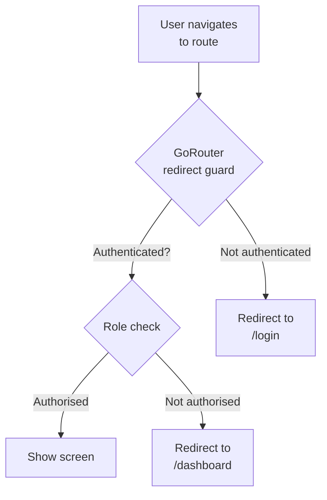

# Chapter 5: Need to Know

> *"Every door in a fortress serves a purpose — and not every soldier carries every key."*

**Estimated time:** ~25 minutes | **Focus:** Route Guards & RBAC | **Branch:** `chapter-5-access-control`

---

## What You Will Learn

- Why missing route guards let any user reach any screen
- How deep links bypass client-side navigation entirely
- How to implement Role-Based Access Control (RBAC) in Flutter
- How to protect routes with GoRouter redirect guards

---

## The Vulnerability: Every Door Is Open

FortKnox has three user roles: `customer`, `teller`, and `admin`. Each role should see different screens. But right now, there is nothing enforcing that. Look at the router configuration:

```dart title="lib/routing/app_router.dart — INSECURE"
final appRouter = GoRouter(
  routes: [
    GoRoute(
      path: '/',
      builder: (context, state) => const DashboardScreen(),
    ),
    GoRoute(
      path: '/transfer',
      builder: (context, state) => const TransferScreen(),
    ),
    GoRoute(
      path: '/admin/users',
      builder: (context, state) => const AdminUsersScreen(),
    ),
    GoRoute(
      path: '/admin/audit-log',
      builder: (context, state) => const AuditLogScreen(),
    ),
    GoRoute(
      path: '/teller/approve',
      builder: (context, state) => const TellerApprovalScreen(),
    ),
  ],
);
```

No authentication check. No role check. A `customer` can type `/admin/audit-log` into a deep link and land directly on the audit log.

### The Deep Link Attack

On both Android and iOS, deep links can navigate directly to any route. An attacker does not need to tap through the UI -- they craft a URL:

```
fortknox://app/admin/users
```

If your app registers this scheme, the OS opens FortKnox and navigates straight to `/admin/users`. Without a route guard, the admin panel is exposed to anyone who knows the path.

:::caution This Is Not Theoretical
OWASP Mobile Top 10 lists **M6: Insecure Authorization** as one of the most common mobile vulnerabilities. Penetration testers routinely scan for unprotected admin routes -- and they find them.
:::

### Seeing the Problem

Launch FortKnox, log in as a `customer`, and then trigger a deep link:

```bash title="Testing on Android emulator"
adb shell am start -a android.intent.action.VIEW \
  -d "fortknox://app/admin/audit-log" \
  com.fortknox.app
```

You will land on the audit log screen. No challenge, no redirect, no error. The "admin-only" screen is available to everyone.

---

## The Fix: Role-Based Access Control

RBAC restricts access based on the user's assigned role. The model is straightforward:



### Step 1: Define the Role Model

```dart title="lib/models/user_role.dart"
enum UserRole {
  customer,
  teller,
  admin;

  /// Returns true if this role has at least the privileges of [required].
  bool hasAccess(UserRole required) {
    return index >= required.index;
  }
}
```

The `hasAccess` method uses enum ordering to create a simple hierarchy: `admin` > `teller` > `customer`. An admin can access teller routes, but not the reverse.

### Step 2: Annotate Routes with Required Roles

Use GoRouter's `extra` field or a custom metadata approach. Here we use a clean extension:

```dart title="lib/routing/route_metadata.dart"
class RouteMetadata {
  final UserRole? requiredRole;
  final bool requiresAuth;

  const RouteMetadata({
    this.requiredRole,
    this.requiresAuth = true,
  });
}

/// Route paths and their access requirements.
const routePermissions = <String, RouteMetadata>{
  '/': RouteMetadata(),
  '/transfer': RouteMetadata(requiredRole: UserRole.customer),
  '/admin/users': RouteMetadata(requiredRole: UserRole.admin),
  '/admin/audit-log': RouteMetadata(requiredRole: UserRole.admin),
  '/teller/approve': RouteMetadata(requiredRole: UserRole.teller),
  '/login': RouteMetadata(requiresAuth: false),
};
```

### Step 3: Build the Redirect Guard

```dart title="lib/routing/app_router.dart — SECURE"
final appRouter = GoRouter(
  redirect: (BuildContext context, GoRouterState state) {
    final authState = context.read<AuthController>();
    final isLoggedIn = authState.isAuthenticated;
    final currentUser = authState.currentUser;
    final path = state.matchedLocation;

    final metadata = routePermissions[path] ??
        const RouteMetadata(); // Default: auth required, no role check

    // 1. Redirect unauthenticated users to login
    if (metadata.requiresAuth && !isLoggedIn) {
      return '/login?redirect=${Uri.encodeComponent(path)}';
    }

    // 2. Redirect authenticated users away from login
    if (path == '/login' && isLoggedIn) {
      return '/';
    }

    // 3. Check role authorisation
    if (metadata.requiredRole != null && currentUser != null) {
      if (!currentUser.role.hasAccess(metadata.requiredRole!)) {
        return '/'; // Bounce to dashboard
      }
    }

    return null; // No redirect — allow navigation
  },
  routes: [
    GoRoute(
      path: '/',
      builder: (context, state) => const DashboardScreen(),
    ),
    GoRoute(
      path: '/transfer',
      builder: (context, state) => const TransferScreen(),
    ),
    GoRoute(
      path: '/admin/users',
      builder: (context, state) => const AdminUsersScreen(),
    ),
    GoRoute(
      path: '/admin/audit-log',
      builder: (context, state) => const AuditLogScreen(),
    ),
    GoRoute(
      path: '/teller/approve',
      builder: (context, state) => const TellerApprovalScreen(),
    ),
    GoRoute(
      path: '/login',
      builder: (context, state) => const LoginScreen(),
    ),
  ],
);
```

:::info The Redirect Parameter
Notice the `?redirect=` query parameter on the login redirect. After the user logs in, you can read this parameter and navigate them back to the page they originally requested -- but only if their role permits it. Never blindly redirect to the stored path without re-validating.
:::

### Testing the Guard

Run the same deep link test:

```bash title="Testing the fix"
adb shell am start -a android.intent.action.VIEW \
  -d "fortknox://app/admin/audit-log" \
  com.fortknox.app
```

If the user is not logged in, they land on `/login`. If they are logged in as a `customer`, they bounce to `/`. Only an `admin` reaches the audit log.

---

## Summary

You have closed the open-corridor vulnerability in FortKnox. Every route now requires authentication by default, and role-sensitive routes demand the correct `UserRole` before granting access. Deep links are funnelled through the same redirect guard as normal navigation, so there is no side door.

In Part 2, you will harden deep link parameter validation and add API-side authorization headers to ensure the server never trusts the client alone.
