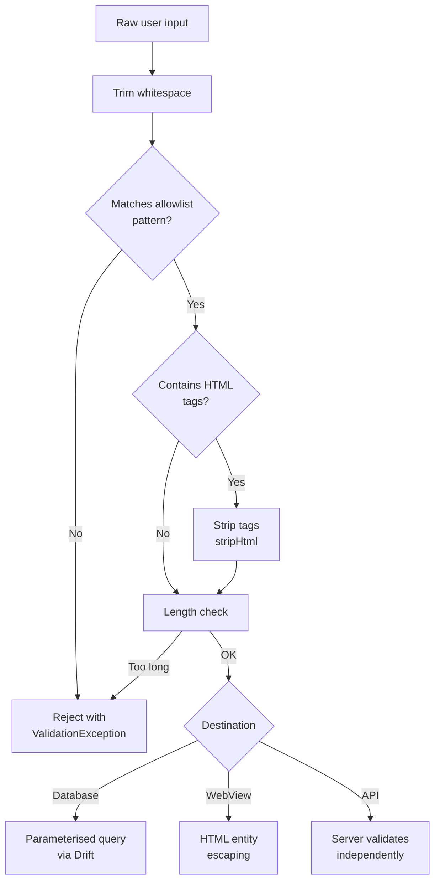

import Tabs from '@theme/Tabs';
import TabItem from '@theme/TabItem';

# Part 2: The Allowlist Arsenal

> *"A good sentry does not ask what is forbidden — they know what is permitted, and reject everything else."*

---

## Input Validation Patterns: Allowlists Over Denylists

Denylisting (blocking known bad input) is a losing game. Attackers constantly invent new payloads. **Allowlisting** flips the model: define exactly what valid input looks like and reject everything that does not match.

### Validation Rules for SecureBank

| Field | Allowlist Pattern | Max Length | Rationale |
|-------|-------------------|------------|-----------|
| Recipient name | `^[a-zA-Z\s\-'.]{1,100}$` | 100 | Names contain letters, spaces, hyphens, apostrophes |
| Sort code | `^\d{2}-\d{2}-\d{2}$` | 8 | UK format: two-digit groups separated by hyphens |
| Account number | `^\d{8}$` | 8 | UK standard: exactly 8 digits |
| Amount (GBP) | `^\d{1,8}(\.\d{1,2})?$` | 12 | Up to 99,999,999.99 with optional pence |
| Reference | `^[a-zA-Z0-9\s\-/]{0,35}$` | 35 | BACS reference: alphanumeric plus basic punctuation |
| IBAN | `^GB\d{2}[A-Z]{4}\d{14}$` | 22 | UK IBAN format |

---

## The SanitizationService

Build a single service that validates and sanitises all user input:

```dart title="lib/utils/sanitization_service.dart"
class SanitizationService {
  // Allowlist patterns
  static final _recipientNamePattern = RegExp(r"^[a-zA-Z\s\-'.]{1,100}$");
  static final _sortCodePattern = RegExp(r'^\d{2}-\d{2}-\d{2}$');
  static final _accountNumberPattern = RegExp(r'^\d{8}$');
  static final _amountPattern = RegExp(r'^\d{1,8}(\.\d{1,2})?$');
  static final _referencePattern = RegExp(r'^[a-zA-Z0-9\s\-/]{0,35}$');
  static final _ibanPattern = RegExp(r'^GB\d{2}[A-Z]{4}\d{14}$');

  /// Validate and return cleaned recipient name, or throw.
  static String validateRecipientName(String input) {
    final trimmed = input.trim();
    if (!_recipientNamePattern.hasMatch(trimmed)) {
      throw ValidationException(
        'Recipient name contains invalid characters.',
        field: 'recipientName',
      );
    }
    return trimmed;
  }

  /// Validate UK sort code format.
  static String validateSortCode(String input) {
    final trimmed = input.trim();
    if (!_sortCodePattern.hasMatch(trimmed)) {
      throw ValidationException(
        'Sort code must be in the format XX-XX-XX.',
        field: 'sortCode',
      );
    }
    return trimmed;
  }

  /// Validate UK account number (8 digits).
  static String validateAccountNumber(String input) {
    final trimmed = input.trim();
    if (!_accountNumberPattern.hasMatch(trimmed)) {
      throw ValidationException(
        'Account number must be exactly 8 digits.',
        field: 'accountNumber',
      );
    }
    return trimmed;
  }

  /// Validate GBP amount.
  static double validateAmount(String input) {
    final trimmed = input.trim();
    if (!_amountPattern.hasMatch(trimmed)) {
      throw ValidationException(
        'Amount must be a valid GBP value (e.g. 250.00).',
        field: 'amount',
      );
    }
    final value = double.parse(trimmed);
    if (value <= 0) {
      throw ValidationException(
        'Amount must be greater than zero.',
        field: 'amount',
      );
    }
    return value;
  }

  /// Validate BACS payment reference.
  static String validateReference(String input) {
    final trimmed = input.trim();
    if (!_referencePattern.hasMatch(trimmed)) {
      throw ValidationException(
        'Reference contains invalid characters. '
        'Use letters, numbers, spaces, hyphens, and forward slashes only.',
        field: 'reference',
      );
    }
    return trimmed;
  }

  /// Validate UK IBAN format.
  static String validateIban(String input) {
    final cleaned = input.replaceAll(RegExp(r'\s'), '').toUpperCase();
    if (!_ibanPattern.hasMatch(cleaned)) {
      throw ValidationException(
        'IBAN must be a valid UK format (e.g. GB29NWBK60161331926819).',
        field: 'iban',
      );
    }
    return cleaned;
  }

  /// Strip all HTML tags for fields that should never contain markup.
  static String stripHtml(String input) {
    return input.replaceAll(RegExp(r'<[^>]*>'), '');
  }
}

class ValidationException implements Exception {
  final String message;
  final String field;

  const ValidationException(this.message, {required this.field});

  @override
  String toString() => 'ValidationException($field): $message';
}
```

### Integrating with the Transfer Form

Wire the service into your form's submission handler:

```dart title="lib/features/transfer/transfer_form.dart (excerpt)"
Future<void> _submitTransfer() async {
  try {
    final recipientName = SanitizationService.validateRecipientName(
      _nameController.text,
    );
    final sortCode = SanitizationService.validateSortCode(
      _sortCodeController.text,
    );
    final accountNumber = SanitizationService.validateAccountNumber(
      _accountController.text,
    );
    final amount = SanitizationService.validateAmount(
      _amountController.text,
    );
    final reference = SanitizationService.validateReference(
      _referenceController.text,
    );

    await _transactionRepository.insertTransaction(
      recipientName: recipientName,
      recipientAccount: '$sortCode $accountNumber',
      amount: amount,
      reference: reference,
    );

    if (mounted) {
      ScaffoldMessenger.of(context).showSnackBar(
        const SnackBar(content: Text('Transfer submitted')),
      );
    }
  } on ValidationException catch (e) {
    if (mounted) {
      ScaffoldMessenger.of(context).showSnackBar(
        SnackBar(
          content: Text(e.message),
          backgroundColor: Colors.red.shade700,
        ),
      );
    }
  }
}
```

:::tip Validate on Both Client and Server
Client-side validation provides instant feedback. Server-side validation provides security. You need both. An attacker who bypasses the Flutter UI will hit the server directly, so the API must re-validate every field with the same (or stricter) rules.
:::

---

## Before and After
<Tabs>
<TabItem value="before" label="Before (Vulnerable)">

```dart title="transaction_repository.dart — STRING INTERPOLATION"
Future<List<Transaction>> searchByRecipient(String query) async {
  final results = await _db.customSelect(
    "SELECT * FROM transactions WHERE recipient_name LIKE '%$query%'",
    readsFrom: {_db.transactions},
  ).get();
  return results.map(_mapRow).toList();
}
```

```dart title="receipt_webview.dart — RAW HTML INJECTION"
final html = '''
<p><strong>Reference:</strong> ${transaction.reference}</p>
''';
```

**Result:** SQL injection exposes all records. XSS in WebView executes arbitrary JavaScript.
</TabItem>
<TabItem value="after" label="After (Hardened)">

```dart title="transaction_repository.dart — PARAMETERISED"
Future<List<Transaction>> searchByRecipient(String query) async {
  return (_db.select(_db.transactions)
    ..where((t) => t.recipientName.like('%$query%'))
  ).get();
}
```

```dart title="receipt_webview.dart — ESCAPED + JS DISABLED"
final html = '''
<p><strong>Reference:</strong> ${HtmlEscape.escape(transaction.reference)}</p>
''';

WebViewController()
  ..setJavaScriptMode(JavaScriptMode.disabled)
  ..loadHtmlString(html);
```

**Result:** Input validated by allowlist. Queries parameterised. HTML escaped. JavaScript disabled in WebView.
</TabItem>
</Tabs>

---

## Comprehensive Sanitisation Flow



---

## Deep Dive

- [OWASP M7: Client Code Quality](https://owasp.org/www-project-mobile-top-10/) -- Covers input validation failures, buffer overflows, and code-level vulnerabilities in mobile apps.
- [SQL Injection Prevention Cheat Sheet](https://cheatsheetseries.owasp.org/cheatsheets/SQL_Injection_Prevention_Cheat_Sheet.html) -- OWASP's definitive guide to preventing SQL injection across all database types.
- [Drift Query Documentation](https://drift.simonbinder.eu/docs/getting-started/expressions/) -- How Drift builds type-safe, parameterised queries with its expression API.
- [WebView Security Best Practices](https://developer.android.com/develop/ui/views/layout/webapps/webview) -- Android documentation on securing WebView components, including JavaScript policies and content loading.
- [XSS Prevention Cheat Sheet](https://cheatsheetseries.owasp.org/cheatsheets/Cross-Site_Scripting_Prevention_Cheat_Sheet.html) -- Context-specific output encoding rules for preventing cross-site scripting.

---

## What's Next

Your inputs are validated and your queries are safe from injection. But an attacker who decompiles your APK can still read your Dart source code, extract API endpoints, and understand your security logic. In **Chapter 7: Behind Closed Doors**, you will learn to obfuscate your Dart code, configure ProGuard rules, and detect tampered builds.
