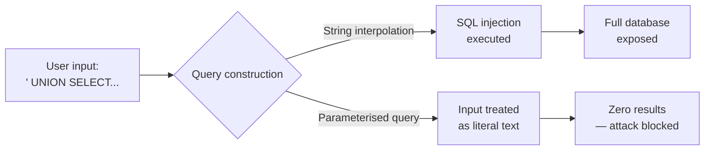

# Chapter 6: Hardened Inputs

> *"Never drink from a well you have not tested — and never trust data you have not validated."*

**Estimated time:** ~30 minutes | **Focus:** Input Validation & Injection Prevention | **Branch:** `chapter-6-hardened-inputs`

---

## What You Will Learn

- How SQL injection works in Drift when using raw string interpolation
- Why parameterised queries are the only safe approach
- How cross-site scripting (XSS) attacks target WebView components
- How to sanitise and validate all user input before it reaches storage or rendering

---

## The Vulnerability: Trusting the User

SecureBank has two injection surfaces hiding in plain sight. The first is a search feature that builds Drift queries with string interpolation. The second is a WebView that renders transaction notes containing user-supplied HTML.

### SQL Injection in Drift

Here is the search function in the transaction repository:

```dart title="lib/data/repositories/transaction_repository.dart — INSECURE"
/// Search transactions by recipient name.
/// WARNING: This is deliberately vulnerable for demonstration.
Future<List<Transaction>> searchByRecipient(String query) async {
  // NEVER DO THIS — raw string interpolation in a query
  final results = await _db.customSelect(
    "SELECT * FROM transactions WHERE recipient_name LIKE '%$query%'",
    readsFrom: {_db.transactions},
  ).get();

  return results.map((row) => Transaction(
    id: row.read<int>('id'),
    recipientName: row.read<String>('recipient_name'),
    recipientAccount: row.read<String>('recipient_account'),
    amount: row.read<double>('amount'),
    currency: row.read<String>('currency'),
    reference: row.read<String>('reference'),
    createdAt: row.read<DateTime>('created_at'),
  )).toList();
}
```

The `$query` variable is spliced directly into the SQL string. An attacker who controls the search input can escape the `LIKE` clause and execute arbitrary SQL.

### The Attack

Enter this in the search field:

```
' UNION SELECT 1, recipient_account, '', amount, '', '', '' FROM transactions --
```

The resulting query becomes:

```sql
SELECT * FROM transactions
WHERE recipient_name LIKE '%'
UNION SELECT 1, recipient_account, '', amount, '', '', ''
FROM transactions --'
```

The `UNION` appends a second result set containing every recipient account number and amount in the database. The `--` comments out the trailing `%'`, keeping the SQL valid.

:::caution SQLite Is Not Immune
Many developers assume SQLite is "just a local database" and therefore safe from injection. It is not. Any database that accepts string-interpolated input is vulnerable. Local does not mean safe -- especially when the attacker has physical access to the device or can influence input through deep links.
:::

### The Fix: Parameterised Queries

Drift supports parameterised queries natively. Replace the interpolated string with a `Variable`:

```dart title="lib/data/repositories/transaction_repository.dart — SECURE"
Future<List<Transaction>> searchByRecipient(String query) async {
  final results = await _db.customSelect(
    'SELECT * FROM transactions WHERE recipient_name LIKE ?',
    variables: [Variable('%$query%')],
    readsFrom: {_db.transactions},
  ).get();

  return results.map((row) => Transaction(
    id: row.read<int>('id'),
    recipientName: row.read<String>('recipient_name'),
    recipientAccount: row.read<String>('recipient_account'),
    amount: row.read<double>('amount'),
    currency: row.read<String>('currency'),
    reference: row.read<String>('reference'),
    createdAt: row.read<DateTime>('created_at'),
  )).toList();
}
```

The `?` placeholder tells SQLite to treat the value as **data**, not as SQL syntax. The same attack string now searches for a recipient literally named `' UNION SELECT...` and returns zero results.



:::tip Prefer Drift's Type-Safe API
Whenever possible, use Drift's generated Dart API instead of `customSelect`. The type-safe API builds parameterised queries automatically:

```dart
Future<List<Transaction>> searchByRecipient(String query) {
  return (_db.select(_db.transactions)
    ..where((t) => t.recipientName.like('%$query%'))
  ).get();
}
```

The `.like()` method uses parameterised binding under the hood. You get compile-time safety and injection protection in one.
:::

---

## XSS in WebView Components

SecureBank displays detailed transaction receipts in a WebView. The receipt includes a "notes" field where users can add comments to their transfers. Here is the vulnerable implementation:

```dart title="lib/features/receipts/receipt_webview.dart — INSECURE"
class ReceiptWebView extends StatelessWidget {
  final Transaction transaction;

  const ReceiptWebView({super.key, required this.transaction});

  @override
  Widget build(BuildContext context) {
    final html = '''
    <!DOCTYPE html>
    <html>
    <head><meta charset="utf-8"></head>
    <body>
      <h2>Transaction Receipt</h2>
      <p><strong>To:</strong> ${transaction.recipientName}</p>
      <p><strong>Amount:</strong> £${transaction.amount.toStringAsFixed(2)}</p>
      <p><strong>Reference:</strong> ${transaction.reference}</p>
    </body>
    </html>
    ''';

    return WebViewWidget(
      controller: WebViewController()
        ..loadHtmlString(html),
    );
  }
}
```

The `transaction.reference` is injected directly into HTML without escaping.

### The Attack

A malicious user (or a compromised backend) sets the reference field to:

```html

```

When the receipt renders, the WebView executes the JavaScript in the `onerror` handler. In a banking context, this could exfiltrate session tokens, redirect the user to a phishing page, or modify the displayed transaction details.

### The Fix: HTML Entity Escaping

Never inject raw user input into HTML. Escape dangerous characters before rendering:

```dart title="lib/utils/html_escape.dart"
class HtmlEscape {
  static String escape(String input) {
    return input
        .replaceAll('&', '&amp;')
        .replaceAll('<', '&lt;')
        .replaceAll('>', '&gt;')
        .replaceAll('"', '&quot;')
        .replaceAll("'", '&#x27;');
  }
}
```

Apply it in the WebView:

```dart title="lib/features/receipts/receipt_webview.dart — SECURE"
final html = '''
<!DOCTYPE html>
<html>
<head><meta charset="utf-8"></head>
<body>
  <h2>Transaction Receipt</h2>
  <p><strong>To:</strong> ${HtmlEscape.escape(transaction.recipientName)}</p>
  <p><strong>Amount:</strong> £${transaction.amount.toStringAsFixed(2)}</p>
  <p><strong>Reference:</strong> ${HtmlEscape.escape(transaction.reference)}</p>
</body>
</html>
''';
```

The `` tag now renders as visible text: `&lt;img src=x onerror=...&gt;`. The browser treats it as content, not markup.

:::info Disable JavaScript When Possible
If your WebView only renders static HTML receipts and does not need interactivity, disable JavaScript entirely:

```dart
WebViewController()
  ..setJavaScriptMode(JavaScriptMode.disabled)
  ..loadHtmlString(html);
```

This eliminates the entire class of XSS attacks in one line. Only enable JavaScript when you have a genuine need for it.
:::

---

## Summary

You have closed two injection surfaces in SecureBank. SQL injection through string-interpolated Drift queries is neutralised by switching to parameterised queries (or Drift's type-safe API). XSS in WebView components is prevented by escaping HTML entities and disabling JavaScript when it is not needed.

In Part 2, you will build a comprehensive `SanitizationService` with allowlist-based validation patterns that catch malicious input before it ever reaches a query or a renderer.
