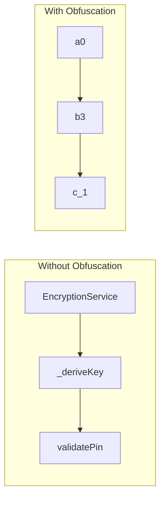

# Chapter 7: Behind Closed Doors

> *"A fortress whose blueprints hang in the town square is no fortress at all."*

**Estimated time:** ~25 minutes | **Focus:** Code Obfuscation & Tamper Detection | **Branch:** `chapter-7-obfuscation`

---

## What You Will Learn

- What attackers can extract from an unobfuscated Flutter APK or IPA
- How Dart's `--obfuscate` and `--split-debug-info` flags work
- What obfuscation protects (and what it does not)
- How to verify obfuscation is working in your release builds

---

## The Vulnerability: Readable Source

Build FortKnox in release mode without obfuscation and examine what ships to users:

```bash title="Building an unobfuscated release"
flutter build apk --release
```

Now decompile the APK. Tools like `jadx` or `apktool` can extract the Dart snapshot, and `darter` or `Doldrums` can parse Dart AOT snapshots to recover class names, method names, and string literals.

### What Attackers Extract

From an unobfuscated Flutter APK, an attacker can recover:

| Artefact | Example | Risk |
|----------|---------|------|
| Class names | `EncryptionService`, `AuthController` | Reveals security architecture |
| Method names | `_deriveKey`, `validatePin`, `forceLogout` | Identifies attack targets |
| String literals | `https://api.fortknox.example.com/v1` | Exposes API endpoints |
| Route paths | `/admin/audit-log`, `/teller/approve` | Maps the entire app structure |
| Error messages | `Invalid PIN: too many attempts` | Reveals business logic |

:::caution This Is a Real Attack Path
Reverse engineering Flutter apps is not theoretical. Public tools exist that parse the Dart AOT snapshot format. Penetration testers routinely decompile mobile banking apps as their first step -- the class and method names become a roadmap for targeted attacks.
:::

### Demonstrating the Exposure

After building without obfuscation, extract and inspect the snapshot:

```bash title="Inspecting the Dart snapshot (Android)"
unzip -o app-release.apk -d extracted/
# The Dart code is in:
# extracted/lib/arm64-v8a/libapp.so (AOT snapshot)

# Using a snapshot analysis tool:
dart_snapshot_analyzer extracted/lib/arm64-v8a/libapp.so --strings
```

The output reveals string constants:

```
"fortknox_pbkdf2_salt"
"Bearer "
"X-User-Role"
"https://api.fortknox.example.com/v1"
"/admin/audit-log"
"EncryptionService not initialised. Call initialise() first."
```

Every secret path, every API endpoint, every error message -- laid bare.

---

## The Fix: Dart Obfuscation Flags

Flutter provides two flags that work together to obfuscate release builds:

```bash title="Building with obfuscation"
flutter build apk --release \
  --obfuscate \
  --split-debug-info=build/debug-info/
```

| Flag | Purpose |
|------|---------|
| `--obfuscate` | Renames classes, methods, and fields to meaningless identifiers (`a`, `b`, `c0`) |
| `--split-debug-info=<dir>` | Extracts debug symbols to a separate directory (required for `--obfuscate`) |

### What Changes

After obfuscation, the same snapshot analysis yields:

```
"a0"
"b3"
"c_1"
```

Class names, method names, and field names are replaced with short, meaningless identifiers. The app functions identically -- but reverse engineering becomes dramatically harder.



### Preserving Crash Reports

The `--split-debug-info` directory contains the mapping between obfuscated and original names. You need this to symbolicate crash reports:

```bash title="Symbolicating a stack trace"
flutter symbolize \
  -i crash_report.txt \
  -d build/debug-info/
```

:::tip Store Debug Info Securely
Upload the debug info directory to your CI artefact storage (not your source repository). You need it for crash analysis, but it must never ship with the app or be publicly accessible -- it is the Rosetta Stone that undoes your obfuscation.
:::

### Configuring for All Platforms

Apply obfuscation to every release target:

```bash title="iOS"
flutter build ipa --release \
  --obfuscate \
  --split-debug-info=build/debug-info-ios/
```

```bash title="Android App Bundle (Play Store)"
flutter build appbundle --release \
  --obfuscate \
  --split-debug-info=build/debug-info-android/
```

```bash title="Web (limited obfuscation)"
flutter build web --release --dart2js-optimization O4
```

:::info Web Builds Are Different
Dart-to-JavaScript compilation (`dart2js`) applies its own minification and tree-shaking at optimisation level O4. The `--obfuscate` flag is not used for web builds. However, web builds are inherently more exposed -- the JavaScript source is always available in the browser. For a banking app, web should be treated as the least-secure platform.
:::

---

## Verifying Obfuscation

Do not trust the build flags alone. Verify that obfuscation is actually applied:

```dart title="lib/utils/obfuscation_check.dart"
/// Utility to verify obfuscation is active in release builds.
class ObfuscationCheck {
  /// Returns true if class names appear obfuscated.
  /// In debug mode, this returns false (names are preserved).
  static bool isObfuscated() {
    final className = ObfuscationCheck.toString();
    // Obfuscated builds rename this class to something short
    return !className.contains('ObfuscationCheck');
  }
}
```

Call it during app startup in release mode:

```dart title="lib/main.dart (excerpt)"
if (kReleaseMode && !ObfuscationCheck.isObfuscated()) {
  // Log a critical warning — the release build is not obfuscated
  debugPrint('WARNING: Release build is NOT obfuscated!');
  // In a real app, you might refuse to start or report to your
  // security monitoring service
}
```

---

## Summary

You have removed the "glass walls" from FortKnox. Dart obfuscation with `--obfuscate` and `--split-debug-info` replaces readable class and method names with meaningless identifiers, forcing attackers to work much harder to understand your app's architecture. You verified that obfuscation is active and set up debug info storage for crash report symbolication.

In Part 2, you will go further: configuring Android ProGuard/R8 rules for the native layer, detecting rooted and jailbroken devices, and implementing signature verification to catch tampered builds.
