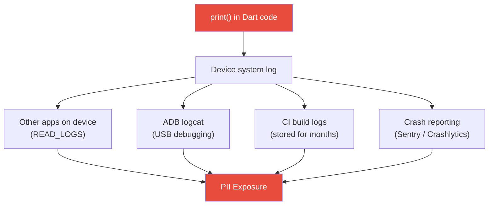

import Tabs from '@theme/Tabs';
import TabItem from '@theme/TabItem';

# Chapter 8: The Watchtower

> *"A fortress with no watchtower is blind to the enemy already inside its walls."* — Medieval military proverb

**Estimated time:** ~25 minutes | **Focus:** Logging & Observability | **Branch:** `chapter-8-watchtower`

---

## The Vulnerability: PII in Console Output

Open `lib/services/auth_service.dart` in the starter branch and run the app. Watch the debug console as you log in:

```dart title="lib/services/auth_service.dart (VULNERABLE)"
class AuthService {
  Future<bool> login(String email, String password) async {
    // highlight-start
    print('LOGIN: email=$email, password=$password');
    print('Token received: eyJhbGciOiJIUzI1NiIsInR5cCI6IkpXVCJ9...');
    // highlight-end

    final response = await _apiClient.post('/auth/login', body: {
      'email': email,
      'password': password,
    });

    if (response.statusCode == 200) {
      final token = response.body['token'];
      // highlight-next-line
      print('Auth success — storing token: $token');
      await _secureStore.write(key: 'auth_token', value: token);
      return true;
    }
    return false;
  }
}
```

Now look at `lib/services/account_service.dart`:

```dart title="lib/services/account_service.dart (VULNERABLE)"
class AccountService {
  Future<Account> fetchAccount(String userId) async {
    final response = await _apiClient.get('/accounts/$userId');
    // highlight-start
    print('Account response: ${response.body}');
    // Outputs: {name: "Jane Smith", email: "jane@example.com",
    //   sortCode: "12-34-56", accountNumber: "12345678",
    //   balance: 14250.00, currency: "GBP"}
    // highlight-end

    return Account.fromJson(response.body);
  }
}
```

Every `print()` statement is a data leak. Here is what ends up exposed:

| Leaked Data | Where It Appears |
|---|---|
| Email addresses | Console, device logs, crash reports |
| Passwords (plaintext!) | Console, device logs |
| JWT tokens | Console, CI build logs |
| Sort codes & account numbers | Console, device logs |
| Full API response bodies | Console, log aggregators |

:::danger Why This Matters
On Android, **any app with the `READ_LOGS` permission** can read logcat output. On rooted or jailbroken devices, console output is trivially accessible. In CI pipelines, build logs are often stored for months and visible to anyone with repository access. Your `print()` calls are broadcasting secrets.
:::

## Understanding the Threat



A single `print('Login: $email')` can traverse at least four paths to an attacker. The fix is not to stop logging — it is to log **safely**.

## Secure Logging Rules

Before writing any code, establish the rules your logging system must enforce:

1. **Never log PII** — emails, names, phone numbers, addresses
2. **Never log secrets** — tokens, passwords, API keys, sort codes, account numbers
3. **Never log full response bodies** — they almost always contain PII
4. **Use log levels** — `debug` logs must never reach production
5. **Redact by default** — if in doubt, mask it

## Building a SecureLogger

Create a new file at `lib/utils/secure_logger.dart`:

```dart title="lib/utils/secure_logger.dart"
import 'dart:developer' as developer;

import 'package:flutter/foundation.dart';

/// Log levels ordered by severity.
enum LogLevel { debug, info, warning, error }

/// Patterns that indicate sensitive data.
final _sensitivePatterns = [
  RegExp(r'[a-zA-Z0-9._%+-]+@[a-zA-Z0-9.-]+\.[a-zA-Z]{2,}'), // email
  RegExp(r'eyJ[A-Za-z0-9_-]{10,}\.[A-Za-z0-9_-]{10,}'),       // JWT
  RegExp(r'\b\d{2}-\d{2}-\d{2}\b'),                            // sort code
  RegExp(r'\b\d{8}\b'),                                         // account number
  RegExp(r'(?:password|passwd|pwd|secret|token|apikey|api_key|authorization)\s*[:=]\s*\S+', caseSensitive: false),
];

class SecureLogger {
  SecureLogger._();
  static final instance = SecureLogger._();

  /// The minimum level that will be emitted. In release mode, debug
  /// messages are always suppressed regardless of this setting.
  LogLevel minimumLevel = LogLevel.info;

  /// Log a debug message. Stripped entirely in release builds.
  void debug(String message, {String? tag}) {
    _log(LogLevel.debug, message, tag: tag);
  }

  /// Log an informational message.
  void info(String message, {String? tag}) {
    _log(LogLevel.info, message, tag: tag);
  }

  /// Log a warning.
  void warning(String message, {String? tag}) {
    _log(LogLevel.warning, message, tag: tag);
  }

  /// Log an error with optional stack trace.
  void error(String message, {String? tag, Object? error, StackTrace? stack}) {
    _log(LogLevel.error, message, tag: tag, error: error, stack: stack);
  }

  void _log(
    LogLevel level,
    String message, {
    String? tag,
    Object? error,
    StackTrace? stack,
  }) {
    // Never emit debug logs in release builds.
    if (level == LogLevel.debug && kReleaseMode) return;

    // Respect minimum level.
    if (level.index < minimumLevel.index) return;

    final sanitised = _redact(message);
    final prefix = '[${level.name.toUpperCase()}]';
    final logTag = tag != null ? '[$tag]' : '';
    final output = '$prefix$logTag $sanitised';

    // Use dart:developer log in debug, which does NOT write to
    // system logs (logcat / os_log). In release, we would send
    // to a secure backend — never print().
    if (kDebugMode) {
      developer.log(
        output,
        name: 'FortKnox',
        error: error,
        stackTrace: stack,
      );
    }
  }

  /// Replace any sensitive data matches with [REDACTED].
  String _redact(String input) {
    var result = input;
    for (final pattern in _sensitivePatterns) {
      result = result.replaceAll(pattern, '[REDACTED]');
    }
    return result;
  }
}

/// Global shorthand so call sites stay clean.
final log = SecureLogger.instance;
```

### Key Design Decisions

| Decision | Reason |
|---|---|
| `dart:developer.log` instead of `print` | `developer.log` feeds the Dart DevTools inspector but does **not** write to Android logcat or iOS os_log in release builds |
| Regex-based redaction | Defence in depth — even if a developer accidentally passes an email, it gets masked |
| `kReleaseMode` gate on debug | Compile-time constant ensures the compiler tree-shakes debug paths entirely |
| Singleton pattern | One logger, one set of rules, one place to audit |

## Replacing print() Across the Codebase

Now systematically replace every `print()` call. Start with the auth service:

```dart title="lib/services/auth_service.dart (SECURE)"
import '../utils/secure_logger.dart';

class AuthService {
  Future<bool> login(String email, String password) async {
    // highlight-next-line
    log.info('Login attempt initiated', tag: 'Auth');
    // No email. No password. Just the event.

    final response = await _apiClient.post('/auth/login', body: {
      'email': email,
      'password': password,
    });

    if (response.statusCode == 200) {
      // highlight-next-line
      log.info('Login succeeded — token stored', tag: 'Auth');
      await _secureStore.write(
        key: 'auth_token',
        value: response.body['token'],
      );
      return true;
    }

    // highlight-next-line
    log.warning('Login failed — status ${response.statusCode}', tag: 'Auth');
    return false;
  }
}
```

And the account service:

```dart title="lib/services/account_service.dart (SECURE)"
import '../utils/secure_logger.dart';

class AccountService {
  Future<Account> fetchAccount(String userId) async {
    log.debug('Fetching account data', tag: 'Account');

    final response = await _apiClient.get('/accounts/$userId');

    if (response.statusCode == 200) {
      // highlight-next-line
      log.info('Account data loaded (${response.contentLength} bytes)', tag: 'Account');
      return Account.fromJson(response.body);
    }

    log.error(
      'Account fetch failed — status ${response.statusCode}',
      tag: 'Account',
    );
    throw AccountException('Failed to load account');
  }
}
```

:::tip The Pattern
Log **what happened**, not **what the data was**. "Login succeeded" tells you everything you need for debugging. "Login succeeded for jane@example.com with token eyJ..." tells an attacker everything they need.
:::

## Adding a Lint Rule

Prevent `print()` from creeping back in. Add a custom lint rule to `analysis_options.yaml`:

```yaml title="analysis_options.yaml"
analyzer:
  errors:
    # Treat print() usage as compile-time error
    # highlight-next-line
    avoid_print: error

linter:
  rules:
    # highlight-next-line
    - avoid_print
```

Now any `print()` call in your codebase will fail static analysis:

```bash title="Terminal"
$ flutter analyze
Analyzing fort_knox...

   error • Don't use `print`. Use the SecureLogger instead. •
           lib/services/auth_service.dart:12:5 • avoid_print

1 issue found.
```

## Testing the Redaction

Write a unit test to verify sensitive data never leaks:

```dart title="test/utils/secure_logger_test.dart"
import 'package:flutter_test/flutter_test.dart';
import 'package:fort_knox/utils/secure_logger.dart';

void main() {
  group('SecureLogger redaction', () {
    final logger = SecureLogger.instance;

    test('redacts email addresses', () {
      final result = logger._redact(
        'User jane.smith@fortknox.co.uk logged in',
      );
      expect(result, contains('[REDACTED]'));
      expect(result, isNot(contains('jane.smith')));
    });

    test('redacts JWT tokens', () {
      final result = logger._redact(
        'Token: eyJhbGciOiJIUzI1NiIsInR5cCI6IkpXVCJ9.eyJzdWIiOiIxMjM0NTY3ODkwIn0.abc',
      );
      expect(result, isNot(contains('eyJ')));
    });

    test('redacts sort codes', () {
      final result = logger._redact('Sort code: 12-34-56');
      expect(result, isNot(contains('12-34-56')));
    });

    test('redacts password fields', () {
      final result = logger._redact('password=SuperSecret123!');
      expect(result, contains('[REDACTED]'));
      expect(result, isNot(contains('SuperSecret123')));
    });

    test('passes through safe messages unchanged', () {
      const safe = 'Account fetch completed in 230ms';
      final result = logger._redact(safe);
      expect(result, equals(safe));
    });
  });
}
```

Run the tests:

```bash title="Terminal"
flutter test test/utils/secure_logger_test.dart
```

:::info Checkpoint
At this point you have: (1) a SecureLogger that redacts PII automatically, (2) all `print()` calls replaced, (3) a lint rule preventing regressions, and (4) tests proving redaction works. In Part 2, you will add structured logging for audit trails and configure crash reporting without leaking PII.
:::
