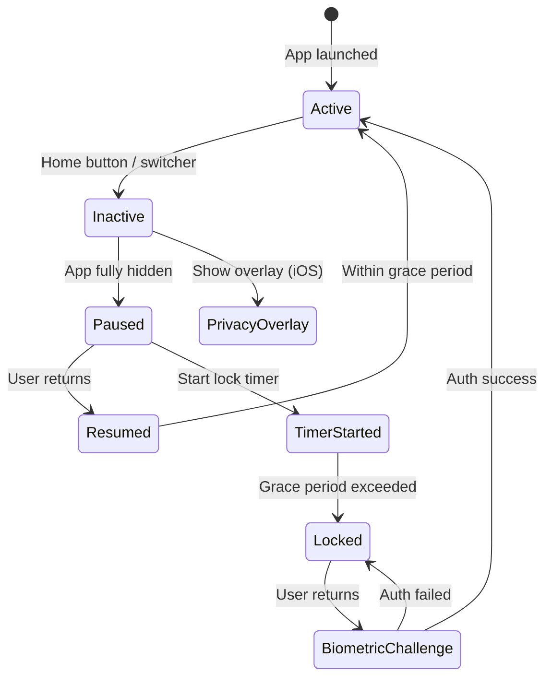

import Tabs from '@theme/Tabs';
import TabItem from '@theme/TabItem';

# Chapter 9: Biometric Checkpoint — Part 2

> *"Security is not a product, but a process."* — Bruce Schneier

**Estimated time:** ~30 minutes | **Focus:** Platform Hardening & App Lifecycle | **Branch:** `chapter-9-biometrics`

---

## Screenshot Prevention

When a user opens the task switcher on their phone, the OS captures a snapshot of the current screen. For a banking app showing a balance of £14,250.00, that thumbnail is a privacy breach waiting to happen.

### Android: FLAG_SECURE

Android provides `FLAG_SECURE`, which prevents the system from capturing screenshots and task-switcher thumbnails.

```kotlin title="android/app/src/main/kotlin/.../MainActivity.kt"
import android.os.Bundle
import android.view.WindowManager
import io.flutter.embedding.android.FlutterFragmentActivity

class MainActivity : FlutterFragmentActivity() {
    override fun onCreate(savedInstanceState: Bundle?) {
        super.onCreate(savedInstanceState)
        // highlight-start
        window.setFlags(
            WindowManager.LayoutParams.FLAG_SECURE,
            WindowManager.LayoutParams.FLAG_SECURE
        )
        // highlight-end
    }
}
```

With `FLAG_SECURE`:
- Screenshots return a black image
- Task switcher shows a blank thumbnail
- Screen recording captures a black frame
- Casting/mirroring is blocked for this activity

### iOS Approach

iOS does not have a direct equivalent of `FLAG_SECURE`. Instead, you overlay a blur or placeholder when the app enters the background:

```dart title="lib/widgets/screen_privacy.dart"
import 'dart:io';
import 'package:flutter/material.dart';

/// Overlays a privacy screen when the app is backgrounded on iOS.
/// On Android, FLAG_SECURE handles this at the native layer.
class ScreenPrivacy extends StatefulWidget {
  final Widget child;
  const ScreenPrivacy({super.key, required this.child});

  @override
  State<ScreenPrivacy> createState() => _ScreenPrivacyState();
}

class _ScreenPrivacyState extends State<ScreenPrivacy>
    with WidgetsBindingObserver {
  bool _showPrivacyOverlay = false;

  @override
  void initState() {
    super.initState();
    WidgetsBinding.instance.addObserver(this);
  }

  @override
  void dispose() {
    WidgetsBinding.instance.removeObserver(this);
    super.dispose();
  }

  @override
  void didChangeAppLifecycleState(AppLifecycleState state) {
    if (!Platform.isIOS) return; // Android uses FLAG_SECURE.

    // highlight-start
    if (state == AppLifecycleState.inactive ||
        state == AppLifecycleState.hidden) {
      setState(() => _showPrivacyOverlay = true);
    } else if (state == AppLifecycleState.resumed) {
      setState(() => _showPrivacyOverlay = false);
    }
    // highlight-end
  }

  @override
  Widget build(BuildContext context) {
    return Stack(
      children: [
        widget.child,
        if (_showPrivacyOverlay)
          // highlight-start
          Positioned.fill(
            child: Container(
              color: const Color(0xFF1A1A2E),
              child: const Center(
                child: Column(
                  mainAxisAlignment: MainAxisAlignment.center,
                  children: [
                    Icon(Icons.shield, size: 48, color: Colors.white38),
                    SizedBox(height: 16),
                    Text(
                      'SecureBank',
                      style: TextStyle(
                        color: Colors.white54,
                        fontSize: 20,
                        fontWeight: FontWeight.w600,
                      ),
                    ),
                  ],
                ),
              ),
            ),
          ),
          // highlight-end
      ],
    );
  }
}
```

:::tip Why inactive and not just paused?
On iOS, the `inactive` state fires *before* `paused` — this is when iOS captures the task-switcher screenshot. If you wait for `paused`, the snapshot has already been taken with your sensitive data visible.
:::

### Combining Both Approaches

Wire the privacy screen alongside the biometric gate in `main.dart`:

```dart title="lib/main.dart (UPDATED)"
import 'widgets/biometric_gate.dart';
import 'widgets/screen_privacy.dart';
import 'services/biometric_service.dart';

class SecureBankApp extends StatelessWidget {
  const SecureBankApp({super.key});

  @override
  Widget build(BuildContext context) {
    return MaterialApp(
      title: 'SecureBank Banking',
      theme: ThemeData.dark(),
      home: ScreenPrivacy(
        child: BiometricGate(
          biometricService: BiometricService(),
          child: const LoginScreen(),
        ),
      ),
    );
  }
}
```

## App Lifecycle Management

The biometric gate from Part 1 handles re-authentication on resume. But a comprehensive lifecycle strategy covers more scenarios:



### Session Timeout

Beyond the resume-lock, add an inactivity timeout that locks the app even while it is in the foreground:

```dart title="lib/services/session_manager.dart"
import 'dart:async';
import 'package:flutter/widgets.dart';
import '../utils/secure_logger.dart';

/// Tracks user activity and locks the session after inactivity.
class SessionManager with WidgetsBindingObserver {
  final VoidCallback onSessionExpired;
  Timer? _inactivityTimer;

  /// Lock after 5 minutes of no interaction.
  static const _inactivityTimeout = Duration(minutes: 5);

  SessionManager({required this.onSessionExpired}) {
    WidgetsBinding.instance.addObserver(this);
    _resetTimer();
  }

  /// Call this on every user interaction (tap, scroll, input).
  void recordActivity() {
    _resetTimer();
  }

  void _resetTimer() {
    _inactivityTimer?.cancel();
    _inactivityTimer = Timer(_inactivityTimeout, () {
      log.audit(action: 'session_expired_inactivity', tag: 'Session');
      onSessionExpired();
    });
  }

  void dispose() {
    _inactivityTimer?.cancel();
    WidgetsBinding.instance.removeObserver(this);
  }
}
```

Wire it with a `Listener` widget that captures all pointer events:

```dart title="lib/widgets/activity_detector.dart"
import 'package:flutter/widgets.dart';
import '../services/session_manager.dart';

class ActivityDetector extends StatelessWidget {
  final SessionManager sessionManager;
  final Widget child;

  const ActivityDetector({
    super.key,
    required this.sessionManager,
    required this.child,
  });

  @override
  Widget build(BuildContext context) {
    return Listener(
      // highlight-next-line
      onPointerDown: (_) => sessionManager.recordActivity(),
      behavior: HitTestBehavior.translucent,
      child: child,
    );
  }
}
```

## Secure Clipboard

When a user copies their account number or sort code, that data sits in the system clipboard where any app can read it. Clear sensitive clipboard content after a timeout:

```dart title="lib/utils/secure_clipboard.dart"
import 'dart:async';
import 'package:flutter/services.dart';
import 'secure_logger.dart';

class SecureClipboard {
  SecureClipboard._();
  static final instance = SecureClipboard._();

  Timer? _clearTimer;

  /// Copy text to clipboard and schedule automatic clearing.
  Future<void> copyWithExpiry(
    String text, {
    Duration expiry = const Duration(seconds: 30),
  }) async {
    await Clipboard.setData(ClipboardData(text: text));
    log.info('Sensitive data copied — will clear in ${expiry.inSeconds}s', tag: 'Clipboard');

    _clearTimer?.cancel();
    // highlight-start
    _clearTimer = Timer(expiry, () async {
      await Clipboard.setData(const ClipboardData(text: ''));
      log.info('Clipboard cleared', tag: 'Clipboard');
    });
    // highlight-end
  }

  /// Immediately clear the clipboard.
  Future<void> clear() async {
    _clearTimer?.cancel();
    await Clipboard.setData(const ClipboardData(text: ''));
    log.info('Clipboard force-cleared', tag: 'Clipboard');
  }
}
```

Use it anywhere the user might copy sensitive data:

```dart title="lib/screens/dashboard_screen.dart (excerpt)"
import '../utils/secure_clipboard.dart';

// In the account number display:
GestureDetector(
  onLongPress: () {
    SecureClipboard.instance.copyWithExpiry(
      account.accountNumber,
      expiry: const Duration(seconds: 30),
    );
    ScaffoldMessenger.of(context).showSnackBar(
      const SnackBar(
        content: Text('Account number copied — clears in 30 seconds'),
      ),
    );
  },
  child: Text('Account: ${account.maskedAccountNumber}'),
)
```

## Before / After
<Tabs>
<TabItem value="before" label="Before (Vulnerable)">

```dart title="lib/main.dart"
class SecureBankApp extends StatelessWidget {
  @override
  Widget build(BuildContext context) {
    return MaterialApp(
      title: 'SecureBank Banking',
      home: const LoginScreen(),
    );
  }
}
```

**Problems:**
- No re-authentication on app resume
- Dashboard visible in task switcher thumbnail
- No session timeout on inactivity
- Clipboard retains sensitive data indefinitely
- App background shows full financial data
</TabItem>
<TabItem value="after" label="After (Secure)">

```dart title="lib/main.dart"
class SecureBankApp extends StatelessWidget {
  const SecureBankApp({super.key});

  @override
  Widget build(BuildContext context) {
    return MaterialApp(
      title: 'SecureBank Banking',
      theme: ThemeData.dark(),
      home: ScreenPrivacy(
        child: BiometricGate(
          biometricService: BiometricService(),
          child: ActivityDetector(
            sessionManager: SessionManager(
              onSessionExpired: () => _navigateToLock(context),
            ),
            child: const LoginScreen(),
          ),
        ),
      ),
    );
  }
}
```

**Improvements:**
- Biometric re-auth required after background grace period
- Privacy overlay hides content in task switcher (iOS)
- FLAG_SECURE blocks screenshots entirely (Android)
- Session expires after 5 minutes of inactivity
- Clipboard auto-clears sensitive data after 30 seconds
</TabItem>
</Tabs>

## Deep Dive

Explore the platform APIs and security guidance behind this chapter:

- [local_auth package](https://pub.dev/packages/local_auth) — Flutter's official biometric authentication plugin
- [Apple LAContext documentation](https://developer.apple.com/documentation/localauthentication/lacontext) — the iOS biometric API that `local_auth` wraps
- [Android BiometricPrompt](https://developer.android.com/reference/android/hardware/biometrics/BiometricPrompt) — the Android biometric API underneath `local_auth`
- [Android FLAG_SECURE](https://developer.android.com/reference/android/view/WindowManager.LayoutParams#FLAG_SECURE) — preventing screen capture at the window level
- [OWASP MSTG — Testing Local Authentication](https://mas.owasp.org/MASTG/tests/ios/MASVS-AUTH/) — comprehensive testing guide for mobile biometric implementations

## What's Next

Your fortress now challenges everyone who approaches and hides its contents from prying eyes. But how do you know the walls themselves are sound? In **Chapter 10: Penetration Test**, you will build static analysis rules, audit your dependencies for known vulnerabilities, and set up a CI pipeline that catches security regressions before they reach production.
