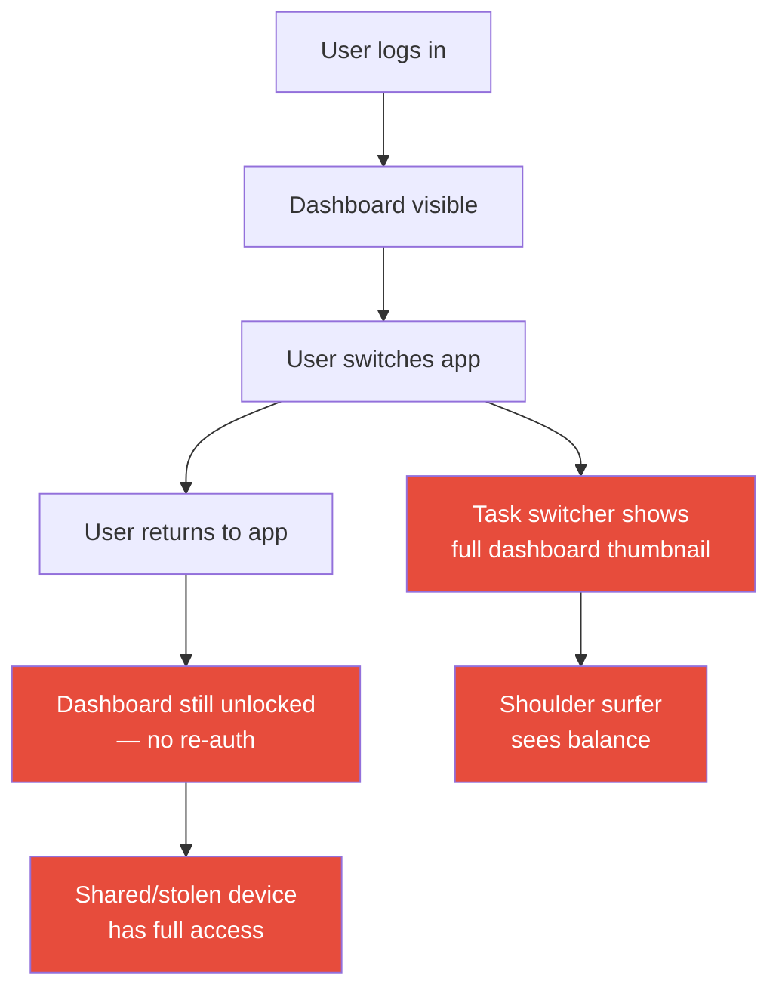

import Tabs from '@theme/Tabs';
import TabItem from '@theme/TabItem';

# Chapter 9: Biometric Checkpoint

> *"A lock is only as strong as the moment you check who is standing at the door."* — Bruce Schneier (paraphrased)

**Estimated time:** ~30 minutes | **Focus:** Authentication & App Lifecycle | **Branch:** `chapter-9-biometrics`

---

## The Vulnerability: No Re-authentication

Open the FortKnox app, log in, then switch to another app. Switch back. You are still on the dashboard — no challenge, no lock screen, full access to the user's balance and transfer capability.

Now try something worse: open the device task switcher. The app's thumbnail shows the full dashboard, including the account balance in GBP.

```dart title="lib/main.dart (VULNERABLE)"
class FortKnoxApp extends StatelessWidget {
  @override
  Widget build(BuildContext context) {
    return MaterialApp(
      title: 'FortKnox Banking',
      // highlight-start
      // No lifecycle observer.
      // No biometric gate.
      // No screenshot prevention.
      // highlight-end
      home: const LoginScreen(),
    );
  }
}
```

```dart title="lib/screens/dashboard_screen.dart (VULNERABLE)"
class DashboardScreen extends StatelessWidget {
  @override
  Widget build(BuildContext context) {
    // highlight-start
    // Anyone who reaches this screen sees everything.
    // No re-authentication. No timeout. No lock.
    // highlight-end
    return Scaffold(
      appBar: AppBar(title: const Text('FortKnox')),
      body: Column(
        children: [
          Text('Balance: £14,250.00', style: Theme.of(context).textTheme.headlineMedium),
          Text('Sort Code: 12-34-56'),
          Text('Account: 12345678'),
          // ... transfer button, history, etc.
        ],
      ),
    );
  }
}
```

The attack surface:



:::danger Real-World Impact
A stolen phone with a banking app that does not re-authenticate on resume gives the thief full access to the account. The UK's Financial Conduct Authority reported a sharp rise in "device theft" fraud in 2023, with banking apps that lacked re-authentication cited as a contributing factor.
:::

## Setting Up local_auth

The `local_auth` package provides a unified API for biometric authentication across iOS and Android.

### 1. Add the Dependency

```yaml title="pubspec.yaml"
dependencies:
  local_auth: ^2.2.0
```

```bash title="Terminal"
flutter pub get
```

### 2. Platform Configuration

#### Android

Add the permission and update `MainActivity`:

```xml title="android/app/src/main/AndroidManifest.xml"
<manifest xmlns:android="http://schemas.android.com/apk/res/android">
    <!-- highlight-next-line -->
    <uses-permission android:name="android.permission.USE_BIOMETRIC" />

    <application ...>
        <activity
            android:name=".MainActivity"
            ...>
        </activity>
    </application>
</manifest>
```

Update `MainActivity` to use `FlutterFragmentActivity` (required by `local_auth`):

```kotlin title="android/app/src/main/kotlin/.../MainActivity.kt"
import io.flutter.embedding.android.FlutterFragmentActivity

// highlight-next-line
class MainActivity : FlutterFragmentActivity()
```

#### iOS

Add the usage description to `Info.plist`:

```xml title="ios/Runner/Info.plist"
<dict>
    <!-- highlight-start -->
    <key>NSFaceIDUsageDescription</key>
    <string>FortKnox uses Face ID to verify your identity before showing account details.</string>
    <!-- highlight-end -->
</dict>
```

## Building the Biometric Service

Create a service that wraps `local_auth` with FortKnox-specific logic:

```dart title="lib/services/biometric_service.dart"
import 'package:local_auth/local_auth.dart';
import 'package:local_auth/error_codes.dart' as auth_error;
import '../utils/secure_logger.dart';

class BiometricService {
  final LocalAuthentication _localAuth = LocalAuthentication();

  /// Check whether the device supports biometric authentication.
  Future<bool> get isAvailable async {
    try {
      final canCheck = await _localAuth.canCheckBiometrics;
      final isSupported = await _localAuth.isDeviceSupported();
      return canCheck && isSupported;
    } catch (e) {
      log.error('Biometric availability check failed', tag: 'Biometric', error: e);
      return false;
    }
  }

  /// List available biometric types (fingerprint, face, iris).
  Future<List<BiometricType>> get availableTypes async {
    try {
      return await _localAuth.getAvailableBiometrics();
    } catch (e) {
      log.error('Failed to query biometric types', tag: 'Biometric', error: e);
      return [];
    }
  }

  /// Prompt the user for biometric verification.
  /// Returns true only on successful authentication.
  Future<bool> authenticate({
    String reason = 'Verify your identity to access FortKnox',
  }) async {
    try {
      log.audit(action: 'biometric_prompt_shown', tag: 'Biometric');

      final result = await _localAuth.authenticate(
        localizedReason: reason,
        options: const AuthenticationOptions(
          // highlight-start
          stickyAuth: true,     // Keep auth active if app briefly backgrounds
          biometricOnly: false, // Allow PIN/passcode as fallback
          // highlight-end
        ),
      );

      if (result) {
        log.audit(action: 'biometric_auth_succeeded', tag: 'Biometric');
      } else {
        log.audit(
          action: 'biometric_auth_cancelled',
          tag: 'Biometric',
          level: LogLevel.warning,
        );
      }

      return result;
    } on PlatformException catch (e) {
      if (e.code == auth_error.notAvailable) {
        log.warning('Biometrics not available on device', tag: 'Biometric');
      } else if (e.code == auth_error.lockedOut) {
        log.warning('Biometric locked out — too many attempts', tag: 'Biometric');
      } else {
        log.error('Biometric auth error: ${e.code}', tag: 'Biometric', error: e);
      }
      return false;
    }
  }
}
```

:::info biometricOnly: false
Setting `biometricOnly` to `false` allows the user to fall back to their device PIN or passcode. This is important for accessibility — not all users can use biometrics — and for scenarios where the biometric sensor fails.
:::

## Biometric Gate on App Resume

The critical piece: challenge the user every time the app returns from the background. Create a lifecycle-aware wrapper:

```dart title="lib/widgets/biometric_gate.dart"
import 'package:flutter/material.dart';
import '../services/biometric_service.dart';
import '../utils/secure_logger.dart';

/// Wraps the main app content and presents a biometric
/// challenge whenever the app returns from the background.
class BiometricGate extends StatefulWidget {
  final Widget child;
  final BiometricService biometricService;

  const BiometricGate({
    super.key,
    required this.child,
    required this.biometricService,
  });

  @override
  State<BiometricGate> createState() => _BiometricGateState();
}

class _BiometricGateState extends State<BiometricGate>
    with WidgetsBindingObserver {
  bool _isLocked = false;
  bool _wasBackgrounded = false;

  /// How long the app can be backgrounded before requiring re-auth.
  static const _gracePeriod = Duration(seconds: 5);
  DateTime? _backgroundedAt;

  @override
  void initState() {
    super.initState();
    WidgetsBinding.instance.addObserver(this);
  }

  @override
  void dispose() {
    WidgetsBinding.instance.removeObserver(this);
    super.dispose();
  }

  @override
  void didChangeAppLifecycleState(AppLifecycleState state) {
    switch (state) {
      case AppLifecycleState.paused:
      case AppLifecycleState.hidden:
        // highlight-start
        _backgroundedAt = DateTime.now();
        _wasBackgrounded = true;
        log.info('App backgrounded — timer started', tag: 'Lifecycle');
        // highlight-end
        break;

      case AppLifecycleState.resumed:
        if (_wasBackgrounded) {
          _wasBackgrounded = false;
          final elapsed = DateTime.now().difference(_backgroundedAt!);

          if (elapsed > _gracePeriod) {
            // highlight-next-line
            _lockAndChallenge();
          } else {
            log.info(
              'Resumed within grace period (${elapsed.inSeconds}s)',
              tag: 'Lifecycle',
            );
          }
        }
        break;

      default:
        break;
    }
  }

  Future<void> _lockAndChallenge() async {
    setState(() => _isLocked = true);
    log.audit(action: 'app_locked_on_resume', tag: 'Lifecycle');

    final authenticated = await widget.biometricService.authenticate(
      reason: 'Verify your identity to resume FortKnox',
    );

    if (authenticated) {
      setState(() => _isLocked = false);
    }
    // If not authenticated, the lock screen stays visible.
    // The user can retry via the button on the lock screen.
  }

  @override
  Widget build(BuildContext context) {
    if (_isLocked) {
      return _LockScreen(
        onRetry: _lockAndChallenge,
      );
    }
    return widget.child;
  }
}

class _LockScreen extends StatelessWidget {
  final VoidCallback onRetry;

  const _LockScreen({required this.onRetry});

  @override
  Widget build(BuildContext context) {
    return Scaffold(
      backgroundColor: const Color(0xFF1A1A2E),
      body: Center(
        child: Column(
          mainAxisAlignment: MainAxisAlignment.center,
          children: [
            const Icon(Icons.lock_outline, size: 64, color: Colors.white70),
            const SizedBox(height: 24),
            const Text(
              'FortKnox Locked',
              style: TextStyle(
                color: Colors.white,
                fontSize: 24,
                fontWeight: FontWeight.bold,
              ),
            ),
            const SizedBox(height: 8),
            const Text(
              'Verify your identity to continue',
              style: TextStyle(color: Colors.white60),
            ),
            const SizedBox(height: 32),
            ElevatedButton.icon(
              onPressed: onRetry,
              icon: const Icon(Icons.fingerprint),
              label: const Text('Unlock'),
              style: ElevatedButton.styleFrom(
                backgroundColor: const Color(0xFF0F3460),
                padding: const EdgeInsets.symmetric(horizontal: 32, vertical: 14),
              ),
            ),
          ],
        ),
      ),
    );
  }
}
```

### Wiring It Into the App

Wrap your `MaterialApp` with the `BiometricGate`:

```dart title="lib/main.dart (SECURE)"
import 'services/biometric_service.dart';
import 'widgets/biometric_gate.dart';

void main() {
  runApp(const FortKnoxApp());
}

class FortKnoxApp extends StatelessWidget {
  const FortKnoxApp({super.key});

  @override
  Widget build(BuildContext context) {
    return MaterialApp(
      title: 'FortKnox Banking',
      theme: ThemeData.dark(),
      // highlight-start
      home: BiometricGate(
        biometricService: BiometricService(),
        child: const LoginScreen(),
      ),
      // highlight-end
    );
  }
}
```

## Testing Biometric Authentication

Use `local_auth`'s testing utilities to write deterministic tests:

```dart title="test/widgets/biometric_gate_test.dart"
import 'package:flutter/material.dart';
import 'package:flutter/services.dart';
import 'package:flutter_test/flutter_test.dart';
import 'package:local_auth/local_auth.dart';
import 'package:fort_knox/widgets/biometric_gate.dart';
import 'package:fort_knox/services/biometric_service.dart';

// Mock that simulates a successful biometric auth.
class MockBiometricService extends BiometricService {
  bool shouldSucceed = true;

  @override
  Future<bool> authenticate({String reason = ''}) async {
    return shouldSucceed;
  }

  @override
  Future<bool> get isAvailable async => true;
}

void main() {
  group('BiometricGate', () {
    late MockBiometricService mockService;

    setUp(() {
      mockService = MockBiometricService();
    });

    testWidgets('shows child when not locked', (tester) async {
      await tester.pumpWidget(
        MaterialApp(
          home: BiometricGate(
            biometricService: mockService,
            child: const Text('Dashboard'),
          ),
        ),
      );

      expect(find.text('Dashboard'), findsOneWidget);
      expect(find.text('FortKnox Locked'), findsNothing);
    });

    testWidgets('shows lock screen text when locked', (tester) async {
      await tester.pumpWidget(
        MaterialApp(
          home: BiometricGate(
            biometricService: mockService,
            child: const Text('Dashboard'),
          ),
        ),
      );

      // Simulate app going to background and returning after grace period.
      // In integration tests, you would use AppLifecycleState directly.
      expect(find.text('Dashboard'), findsOneWidget);
    });
  });
}
```

:::info Checkpoint
At this point you have biometric authentication wired into the app lifecycle. The app locks after the grace period and requires fingerprint, face, or PIN to resume. In Part 2, you will tackle screenshot prevention, secure clipboard handling, and platform-specific hardening.
:::
