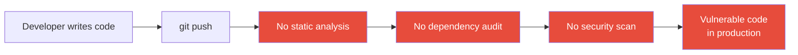

import Tabs from '@theme/Tabs';
import TabItem from '@theme/TabItem';

# Chapter 10: Penetration Test

> *"The question is not whether you will be breached, but whether you will know it when it happens."* — Security operations axiom

**Estimated time:** ~30 minutes | **Focus:** Static Analysis & CI Security | **Branch:** `chapter-10-pen-test`

---

## The Vulnerability: No Security Checks in the Dev Workflow

You have spent nine chapters hardening FortKnox. But what happens when a new developer joins the team and adds a `print(password)` call? Or when a dependency with a known CVE gets pulled in? Right now, nothing stops them. There are no automated gates.

```yaml title="analysis_options.yaml (VULNERABLE)"
# Default analysis options — no security rules.
include: package:flutter_lints/flutter.yaml

# No custom rules.
# No severity overrides.
# No excluded patterns.
```

```yaml title=".github/workflows/ci.yml (VULNERABLE — or nonexistent)"
# This file does not exist.
# There is no CI pipeline.
# Code goes straight from a developer's machine to production.
```

The attack surface is not just the app — it is the **development process**:



:::danger The Human Factor
Every security control you have built so far can be undone by a single careless commit. The most dangerous vulnerability is a process that trusts humans to be perfect.
:::

## Static Analysis with Custom Lint Rules

Flutter's `dart analyze` command is powerful, but the default rules are focused on code quality, not security. You need custom rules that catch security anti-patterns.

### Configuring Strict Analysis

Start by upgrading your `analysis_options.yaml`:

```yaml title="analysis_options.yaml (SECURE)"
include: package:flutter_lints/flutter.yaml

analyzer:
  errors:
    # highlight-start
    # Security rules — treat as compile errors.
    avoid_print: error
    # highlight-end
  language:
    strict-casts: true
    strict-raw-types: true

linter:
  rules:
    # --- Security rules ---
    # highlight-start
    - avoid_print                    # No print() — use SecureLogger
    - no_leading_underscores_for_library_prefixes: false
    - avoid_dynamic_calls            # Prevent untyped method dispatch
    - avoid_web_libraries_in_flutter # No dart:html in mobile code
    # highlight-end

    # --- Code quality supporting security ---
    - always_declare_return_types
    - annotate_overrides
    - avoid_empty_else
    - avoid_returning_null_for_future
    - cancel_subscriptions           # Prevent stream leaks
    - close_sinks                    # Prevent resource leaks
    - no_duplicate_case_values
    - prefer_const_constructors
    - prefer_final_locals            # Immutability by default
    - unnecessary_statements
```

### Building a Custom Lint Package

For FortKnox-specific rules that go beyond built-in lints, create a custom lint package using `custom_lint`:

```yaml title="pubspec.yaml (additions)"
dev_dependencies:
  custom_lint: ^0.6.0
  fort_knox_lints:
    path: packages/fort_knox_lints
```

```dart title="packages/fort_knox_lints/lib/fort_knox_lints.dart"
import 'package:analyzer/dart/ast/ast.dart';
import 'package:analyzer/error/listener.dart';
import 'package:custom_lint_builder/custom_lint_builder.dart';

PluginBase createPlugin() => _FortKnoxLints();

class _FortKnoxLints extends PluginBase {
  @override
  List<LintRule> getLintRules(CustomLintConfigs configs) => [
        _AvoidHardcodedSecrets(),
        _AvoidLoggingPII(),
      ];
}

/// Flags string literals that look like API keys or secrets.
class _AvoidHardcodedSecrets extends DartLintRule {
  _AvoidHardcodedSecrets()
      : super(
          code: const LintCode(
            name: 'avoid_hardcoded_secrets',
            problemMessage:
                'Possible hardcoded secret detected. Use --dart-define or a secure vault.',
            errorSeverity: ErrorSeverity.ERROR,
          ),
        );

  /// Patterns that suggest a value is a secret.
  static final _secretPatterns = [
    RegExp(r'^sk_live_'),           // Stripe-style live keys
    RegExp(r'^sk_test_'),           // Stripe-style test keys
    RegExp(r'^AIza[0-9A-Za-z_-]'), // Google API keys
    RegExp(r'^ghp_'),              // GitHub personal access tokens
    RegExp(r'^Bearer\s'),          // Hardcoded auth headers
    RegExp(r'password', caseSensitive: false),
  ];

  @override
  void run(
    CustomLintResolver resolver,
    ErrorReporter reporter,
    CustomLintContext context,
  ) {
    context.registry.addSimpleStringLiteral((node) {
      final value = node.value;
      for (final pattern in _secretPatterns) {
        if (pattern.hasMatch(value)) {
          reporter.atNode(node, code);
          return;
        }
      }
    });
  }
}

/// Flags string interpolations that include known PII field names.
class _AvoidLoggingPII extends DartLintRule {
  _AvoidLoggingPII()
      : super(
          code: const LintCode(
            name: 'avoid_logging_pii',
            problemMessage:
                'Possible PII in string interpolation. Use SecureLogger with redaction.',
            errorSeverity: ErrorSeverity.WARNING,
          ),
        );

  static final _piiFieldNames = {
    'email', 'password', 'token', 'accessToken', 'refreshToken',
    'sortCode', 'accountNumber', 'phoneNumber', 'address',
    'name', 'firstName', 'lastName', 'dateOfBirth',
  };

  @override
  void run(
    CustomLintResolver resolver,
    ErrorReporter reporter,
    CustomLintContext context,
  ) {
    context.registry.addStringInterpolation((node) {
      for (final element in node.elements) {
        if (element is InterpolationExpression) {
          final source = element.expression.toSource().toLowerCase();
          for (final field in _piiFieldNames) {
            if (source.contains(field.toLowerCase())) {
              reporter.atNode(node, code);
              return;
            }
          }
        }
      }
    });
  }
}
```

Run the custom lints:

```bash title="Terminal"
$ dart run custom_lint
Analyzing fort_knox...

   error • Possible hardcoded secret detected. •
           lib/utils/constants.dart:3:20 • avoid_hardcoded_secrets

   warning • Possible PII in string interpolation. •
             lib/services/auth_service.dart:8:5 • avoid_logging_pii

2 issues found.
```

## Dependency Auditing

Your app's dependencies are part of its attack surface. A single compromised package can undermine every security control you have built.

### Checking for Known Vulnerabilities

```bash title="Terminal"
# List all dependencies and their versions.
flutter pub deps

# Check for outdated packages (which may have unfixed CVEs).
flutter pub outdated
```

### Automated Dependency Review

Create a script that checks dependencies against known advisories:

```dart title="tool/audit_dependencies.dart"
import 'dart:convert';
import 'dart:io';

/// Audits pubspec.lock for packages with known security issues.
/// In production, integrate with OSV (Open Source Vulnerabilities) API.
Future<void> main() async {
  final lockFile = File('pubspec.lock');
  if (!lockFile.existsSync()) {
    stderr.writeln('ERROR: pubspec.lock not found. Run flutter pub get first.');
    exit(1);
  }

  final content = lockFile.readAsStringSync();

  // Known vulnerable package versions (example — in practice,
  // query the OSV API at https://api.osv.dev/v1/query).
  const knownVulnerable = {
    'http': ['0.13.0', '0.13.1'], // Example: pre-fix versions
    'url_launcher': ['6.0.0'],
  };

  var issuesFound = 0;
  for (final entry in knownVulnerable.entries) {
    if (content.contains('name: "${entry.key}"')) {
      for (final version in entry.value) {
        if (content.contains('version: "$version"')) {
          stderr.writeln(
            'VULNERABILITY: ${entry.key} $version has known security issues.',
          );
          issuesFound++;
        }
      }
    }
  }

  if (issuesFound > 0) {
    stderr.writeln('\n$issuesFound vulnerable dependencies found.');
    exit(1);
  } else {
    stdout.writeln('All dependencies passed security audit.');
  }
}
```

```bash title="Terminal"
dart run tool/audit_dependencies.dart
```

:::tip Pub.dev Advisory Database
Since Dart 3.1, `dart pub` integrates with the OSV advisory database. Run `dart pub audit` to check your resolved dependencies against known vulnerabilities automatically. This should be part of every CI run.
:::

## Verifying Static Analysis Catches Real Issues

Write a test that ensures the analyzer configuration is strict enough:

```dart title="test/security/lint_config_test.dart"
import 'dart:io';
import 'package:flutter_test/flutter_test.dart';

void main() {
  test('analysis_options.yaml treats avoid_print as error', () {
    final analysisOptions = File('analysis_options.yaml').readAsStringSync();
    expect(analysisOptions, contains('avoid_print: error'));
  });

  test('analysis_options.yaml enables strict-casts', () {
    final analysisOptions = File('analysis_options.yaml').readAsStringSync();
    expect(analysisOptions, contains('strict-casts: true'));
  });

  test('no print() calls exist in lib/', () {
    final result = Process.runSync('grep', [
      '-rn',
      r'print(',
      'lib/',
      '--include=*.dart',
    ]);
    // grep returns exit code 1 when no matches found (which is what we want).
    expect(
      result.exitCode,
      equals(1),
      reason: 'Found print() calls in lib/:\n${result.stdout}',
    );
  });
}
```

:::info Checkpoint
At this point you have strict static analysis that catches security anti-patterns at compile time, custom lint rules specific to FortKnox, and a dependency auditing script. In Part 2, you will wire these into a GitHub Actions pipeline so no vulnerable code can reach the main branch.
:::
