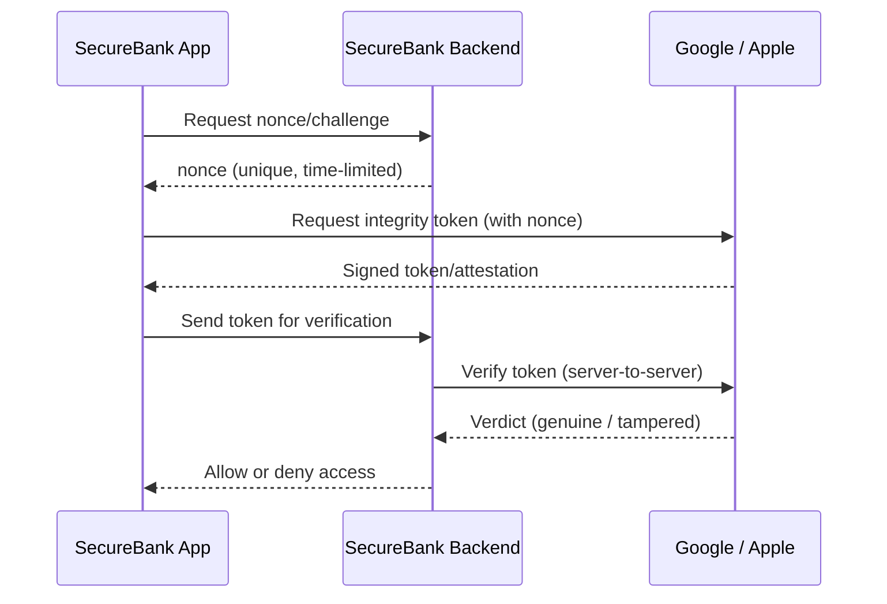

import Tabs from '@theme/Tabs';
import TabItem from '@theme/TabItem';

# Chapter 11: Deployment Lockdown — Part 2

> *"Trust, but verify. Then verify again."* — Adapted from the Reagan-era proverb

**Estimated time:** ~30 minutes | **Focus:** Runtime Integrity & App Attestation | **Branch:** `chapter-11-deployment`

---

## Runtime Integrity Checks

Even with proper signing and environment config, a release build can be tampered with after distribution. Runtime integrity checks detect when the app is running in a hostile environment.

### Debugger Detection

A debugger attached to a release build is a strong signal of reverse engineering:

```dart title="lib/security/integrity_checks.dart"
import 'dart:developer' as developer;
import 'dart:io';

import 'package:flutter/foundation.dart';
import '../utils/secure_logger.dart';

class IntegrityChecks {
  /// Returns true if a debugger is currently attached.
  static bool get isDebuggerAttached {
    // In release mode, check the Dart VM service protocol.
    bool attached = false;

    // highlight-start
    assert(() {
      // This block only executes in debug mode.
      // In release mode, assert is compiled out entirely.
      attached = true;
      return true;
    }());

    // Additional check: if running in release mode but a debugger
    // is attached via the observatory protocol.
    if (!attached && !kDebugMode) {
      // developer.Service.getInfo() will indicate if a debugger is present.
      // The presence of a service URI in release mode is suspicious.
      attached = developer.Service.getInfo().serverUri != null;
    }
    // highlight-end

    return attached;
  }

  /// Returns true if the app is running on an emulator/simulator.
  static Future<bool> get isEmulator async {
    if (Platform.isAndroid) {
      // highlight-start
      // Check common emulator fingerprints.
      final result = await Process.run('getprop', ['ro.hardware']);
      final hardware = (result.stdout as String).trim().toLowerCase();
      return hardware.contains('goldfish') ||
             hardware.contains('ranchu') ||
             hardware.contains('sdk');
      // highlight-end
    }

    if (Platform.isIOS) {
      // On iOS, check for the simulator architecture.
      // The #if targetEnvironment(simulator) approach works in Swift,
      // but from Dart we check the platform model.
      return !kReleaseMode; // Simplified — production builds are never on simulators.
    }

    return false;
  }

  /// Returns true if the device appears to be rooted/jailbroken.
  static Future<bool> get isRooted async {
    if (Platform.isAndroid) {
      // highlight-start
      // Check for common root indicators.
      final suCheck = await Process.run('which', ['su']);
      if ((suCheck.stdout as String).trim().isNotEmpty) return true;

      // Check for Magisk or SuperSU.
      final paths = [
        '/system/app/Superuser.apk',
        '/sbin/su',
        '/system/bin/su',
        '/system/xbin/su',
        '/data/local/xbin/su',
        '/data/local/bin/su',
        '/system/sd/xbin/su',
      ];

      for (final path in paths) {
        if (await File(path).exists()) return true;
      }
      // highlight-end
    }

    if (Platform.isIOS) {
      // Check for common jailbreak indicators.
      final paths = [
        '/Applications/Cydia.app',
        '/Library/MobileSubstrate/MobileSubstrate.dylib',
        '/bin/bash',
        '/usr/sbin/sshd',
        '/etc/apt',
        '/private/var/lib/apt/',
      ];

      for (final path in paths) {
        if (await File(path).exists()) return true;
      }
    }

    return false;
  }
}
```

### Running Integrity Checks at Startup

```dart title="lib/main.dart (SECURE — final version)"
import 'config/app_config.dart';
import 'security/integrity_checks.dart';
import 'utils/secure_logger.dart';

Future<void> main() async {
  WidgetsFlutterBinding.ensureInitialized();

  // Validate configuration.
  AppConfig.validate();

  // highlight-start
  // Runtime integrity checks (release mode only).
  if (kReleaseMode) {
    if (IntegrityChecks.isDebuggerAttached) {
      log.audit(
        action: 'debugger_detected',
        tag: 'Integrity',
        level: LogLevel.error,
      );
      // Option: exit the app, or degrade gracefully.
      exit(1);
    }

    if (await IntegrityChecks.isRooted) {
      log.audit(
        action: 'rooted_device_detected',
        tag: 'Integrity',
        level: LogLevel.warning,
      );
      // Option: show a warning, disable sensitive features,
      // or refuse to run. SecureBank takes a hard line:
      exit(1);
    }
  }
  // highlight-end

  runApp(const SecureBankApp());
}
```

:::caution A Note on Root Detection
Root/jailbreak detection is not foolproof. Determined attackers can bypass these checks using frameworks like Frida or Magisk Hide. Treat integrity checks as a **speed bump**, not a wall. Layer them with server-side verification (app attestation) for real assurance.
:::

## App Attestation

App attestation shifts the trust question from the device to a trusted third party (Google or Apple). Instead of the app checking itself, a remote service verifies that the app is genuine.

### Android: Play Integrity API

```dart title="lib/security/play_integrity.dart"
import 'dart:convert';
import 'package:http/http.dart' as http;
import '../config/app_config.dart';
import '../utils/secure_logger.dart';

/// Verifies app integrity using the Google Play Integrity API.
class PlayIntegrityService {
  /// Request an integrity verdict from Google Play.
  Future<bool> verifyIntegrity() async {
    try {
      // highlight-start
      // 1. Request a nonce from your backend (prevents replay attacks).
      final nonceResponse = await http.get(
        Uri.parse('${AppConfig.apiBaseUrl}/integrity/nonce'),
      );
      final nonce = jsonDecode(nonceResponse.body)['nonce'] as String;

      // 2. Call the Play Integrity API via platform channel.
      // (Uses the play_integrity plugin or a method channel.)
      final token = await _requestIntegrityToken(nonce);

      // 3. Send the token to your backend for verification.
      // NEVER verify the token on-device — the device is untrusted.
      final verifyResponse = await http.post(
        Uri.parse('${AppConfig.apiBaseUrl}/integrity/verify'),
        headers: {'Content-Type': 'application/json'},
        body: jsonEncode({'token': token}),
      );

      final verdict = jsonDecode(verifyResponse.body);
      final isGenuine = verdict['deviceIntegrity'] == 'MEETS_DEVICE_INTEGRITY';
      // highlight-end

      log.audit(
        action: isGenuine ? 'integrity_verified' : 'integrity_failed',
        tag: 'PlayIntegrity',
        metadata: {'verdict': verdict['deviceIntegrity'] ?? 'unknown'},
      );

      return isGenuine;
    } catch (e) {
      log.error('Play Integrity check failed', tag: 'PlayIntegrity', error: e);
      return false;
    }
  }

  Future<String> _requestIntegrityToken(String nonce) async {
    // Platform channel call to Android's IntegrityManager.
    // In a real app, use the play_integrity package or a MethodChannel.
    throw UnimplementedError(
      'Wire this to IntegrityManager.requestIntegrityToken()',
    );
  }
}
```

### iOS: App Attest

```dart title="lib/security/app_attest.dart"
import 'dart:convert';
import 'package:http/http.dart' as http;
import '../config/app_config.dart';
import '../utils/secure_logger.dart';

/// Verifies app integrity using Apple's App Attest service.
class AppAttestService {
  /// Attest the app and verify with the backend.
  Future<bool> verifyAttestation() async {
    try {
      // highlight-start
      // 1. Generate a key pair via DCAppAttestService (platform channel).
      final keyId = await _generateAttestKey();

      // 2. Request a challenge from your backend.
      final challengeResponse = await http.get(
        Uri.parse('${AppConfig.apiBaseUrl}/attest/challenge'),
      );
      final challenge = jsonDecode(challengeResponse.body)['challenge'] as String;

      // 3. Attest the key with Apple's servers (platform channel).
      final attestation = await _attestKey(keyId, challenge);

      // 4. Send attestation to your backend for verification.
      // The backend validates the attestation with Apple.
      final verifyResponse = await http.post(
        Uri.parse('${AppConfig.apiBaseUrl}/attest/verify'),
        headers: {'Content-Type': 'application/json'},
        body: jsonEncode({
          'keyId': keyId,
          'attestation': base64Encode(attestation),
          'challenge': challenge,
        }),
      );

      final isValid = jsonDecode(verifyResponse.body)['valid'] == true;
      // highlight-end

      log.audit(
        action: isValid ? 'app_attest_verified' : 'app_attest_failed',
        tag: 'AppAttest',
      );

      return isValid;
    } catch (e) {
      log.error('App Attest check failed', tag: 'AppAttest', error: e);
      return false;
    }
  }

  Future<String> _generateAttestKey() async {
    throw UnimplementedError(
      'Wire to DCAppAttestService.generateKey()',
    );
  }

  Future<List<int>> _attestKey(String keyId, String challenge) async {
    throw UnimplementedError(
      'Wire to DCAppAttestService.attestKey()',
    );
  }
}
```



:::info Why Server-Side Verification?
The integrity token must be verified on your backend, not on the device. The device is the untrusted entity — letting it verify its own attestation is like letting a suspect judge their own trial.
:::

## Release Security Checklist

Before every production release, run through this checklist:

### Build Configuration
- [ ] All secrets injected via `--dart-define` (none in source code)
- [ ] Release build uses production signing (not debug keystore)
- [ ] ProGuard/R8 enabled with appropriate rules
- [ ] Dart obfuscation enabled (`--obfuscate --split-debug-info`)
- [ ] `kReleaseMode` gates verified (no debug logging in release)

### Security Controls
- [ ] Certificate pinning configured and tested
- [ ] Biometric re-authentication working on resume
- [ ] FLAG_SECURE enabled (Android) / privacy overlay working (iOS)
- [ ] Session timeout functional
- [ ] Clipboard auto-clear functional

### Integrity
- [ ] Play Integrity API / App Attest integrated and backend verification working
- [ ] Debugger detection active in release builds
- [ ] Root/jailbreak detection active with appropriate response

### CI/CD
- [ ] All security pipeline checks passing
- [ ] Dependency audit clean (no known CVEs)
- [ ] Custom lint rules passing
- [ ] No warnings or infos from `dart analyze`

### Monitoring
- [ ] Sentry/Crashlytics configured with PII scrubbing
- [ ] Audit log events reaching the backend
- [ ] Alerting configured for integrity check failures

## Before / After
<Tabs>
<TabItem value="before" label="Before (Vulnerable)">

```dart title="lib/utils/constants.dart"
class AppConstants {
  static const String apiKey = 'sk_live_securebank_9a8b7c6d5e4f3g2h1i';
  static const String apiBaseUrl = 'https://api.securebank.co.uk/v1';
  static const String sentryDsn = 'https://abc123@sentry.io/456';
}
```

```groovy title="android/app/build.gradle"
buildTypes {
    release {
        signingConfig signingConfigs.debug
    }
}
```

**Problems:**
- API keys hardcoded in source, visible in Git history
- Debug signing used for release builds
- No runtime integrity checks
- No app attestation
- No environment separation
</TabItem>
<TabItem value="after" label="After (Secure)">

```dart title="lib/config/app_config.dart"
class AppConfig {
  static const String apiKey = String.fromEnvironment('API_KEY');
  static const String apiBaseUrl = String.fromEnvironment('API_BASE_URL');
  static const String sentryDsn = String.fromEnvironment('SENTRY_DSN');
  static const String environment = String.fromEnvironment('ENV');

  static void validate() {
    if (apiKey.isEmpty) throw StateError('Missing API_KEY');
  }
}
```

```yaml title=".github/workflows/release.yml"
- name: Build release APK
  run: |
    flutter build apk --release \
      --obfuscate --split-debug-info=build/symbols \
      --dart-define=API_KEY=${{ secrets.API_KEY }} \
      --dart-define=ENV=production
```

**Improvements:**
- Zero secrets in source code or Git history
- Release signing with a dedicated keystore
- Runtime debugger, emulator, and root detection
- Play Integrity / App Attest for server-verified integrity
- CI injects secrets via encrypted GitHub Secrets
- Full release checklist enforced before every deployment
</TabItem>
</Tabs>

## Tutorial Recap

Over eleven chapters, you have transformed SecureBank from a deliberately vulnerable banking prototype into a hardened application:

| Chapter | Threat | Defence |
|---|---|---|
| **0** Threat Briefing | Unaware of risks | OWASP Mobile Top 10 mapping |
| **1** Front Door | Hardcoded credentials | Token-based auth, secure session management |
| **2** Vault Door | Plaintext storage | flutter_secure_storage, Keychain, EncryptedSharedPreferences |
| **3** Encrypted Channels | HTTP, no pinning | HTTPS + certificate pinning |
| **4** Payload | Weak encryption | AES-GCM with proper key derivation |
| **5** Access Control | Missing authorisation | Role-based access, token validation |
| **6** Hardened Inputs | No input validation | Sanitisation, injection prevention |
| **7** Obfuscation | Debug symbols shipped | `--obfuscate`, `--split-debug-info`, ProGuard |
| **8** Watchtower | PII in logs | SecureLogger, structured audit trails, PII-free crash reports |
| **9** Biometric Checkpoint | No re-auth | Biometrics on resume, FLAG_SECURE, clipboard clearing |
| **10** Penetration Test | No automated security checks | Custom lints, dependency auditing, CI security pipeline |
| **11** Deployment Lockdown | Debug signing, secrets in source | --dart-define, runtime integrity, app attestation |

## Where to Go From Here

Security is not a destination — it is a discipline. Here are your next steps:

**Continue learning:**
- Work through the [OWASP Mobile Application Security Verification Standard (MASVS)](https://mas.owasp.org/MASVS/) — the industry framework for mobile security requirements
- Study the [OWASP Mobile Security Testing Guide (MSTG)](https://mas.owasp.org/MASTG/) for advanced penetration testing techniques
- Follow the [Dart security advisories](https://github.com/dart-lang/sdk/security/advisories) for language-level vulnerabilities

**Join the community:**
- Participate in [OWASP community events](https://owasp.org/chapters/) — local chapters run meetups worldwide
- Explore [bug bounty programmes](https://www.hackerone.com/) on HackerOne and Bugcrowd to test your skills against real targets (legally)
- Contribute to open-source security tools for Flutter and Dart

**Stay vigilant:**
- Schedule quarterly dependency audits
- Rotate API keys and signing certificates on a calendar
- Run the manual penetration test checklist before every major release
- Monitor your audit logs for anomalies — the watchtower never sleeps

## Deep Dive

Explore the tools and services behind this chapter:

- [Google Play Integrity API](https://developer.android.com/google/play/integrity) — server-side verification that your app is genuine and unmodified
- [Apple App Attest](https://developer.apple.com/documentation/devicecheck/establishing-your-app-s-integrity) — Apple's equivalent for verifying app authenticity
- [Flutter --dart-define documentation](https://dart.dev/tools/dart-compile#configuring-apps-with-compilation-environment-declarations) — compile-time environment configuration
- [GitHub Actions Encrypted Secrets](https://docs.github.com/en/actions/security-guides/encrypted-secrets) — secure CI/CD secret management
- [OWASP Mobile Application Security Verification Standard](https://mas.owasp.org/MASVS/) — the definitive checklist for mobile app security
