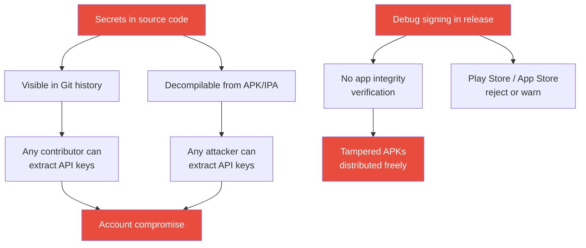

import Tabs from '@theme/Tabs';
import TabItem from '@theme/TabItem';

# Chapter 11: Deployment Lockdown

> *"A castle's gate is strongest when the drawbridge is raised and the portcullis is down. A mobile app is strongest when every secret is sealed and every build is signed."* — FortKnox field manual

**Estimated time:** ~30 minutes | **Focus:** Build Configuration & Key Management | **Branch:** `chapter-11-deployment`

---

## The Vulnerability: Debug Signing and Secrets in Source

Open the FortKnox starter project and look at how it handles configuration:

```dart title="lib/utils/constants.dart (VULNERABLE)"
class AppConstants {
  // highlight-start
  // API key committed to source control.
  static const String apiKey = 'sk_live_fortknox_9a8b7c6d5e4f3g2h1i';

  // API base URL hardcoded — no environment switching.
  static const String apiBaseUrl = 'https://api.fortknox.co.uk/v1';

  // Sentry DSN in source code.
  static const String sentryDsn = 'https://abc123@sentry.io/456';
  // highlight-end
}
```

```groovy title="android/app/build.gradle (VULNERABLE)"
android {
    // highlight-start
    // Using debug signing for everything — including release.
    signingConfigs {
        debug {
            // Default debug keystore — shared across all dev machines.
        }
    }

    buildTypes {
        release {
            signingConfig signingConfigs.debug  // DEBUG SIGNING IN RELEASE!
        }
    }
    // highlight-end
}
```

The problems are severe:



:::danger Every Commit Is Forever
Even if you delete a secret from the latest commit, it remains in Git history. Once a key is committed, consider it compromised. Rotate it immediately and use the techniques in this chapter going forward.
:::

## Environment Configuration with --dart-define

Flutter's `--dart-define` flag injects compile-time constants without putting them in source code:

```bash title="Terminal"
flutter run \
  --dart-define=API_KEY=sk_live_fortknox_9a8b7c6d5e4f3g2h1i \
  --dart-define=API_BASE_URL=https://api.fortknox.co.uk/v1 \
  --dart-define=SENTRY_DSN=https://abc123@sentry.io/456 \
  --dart-define=ENV=staging
```

Read these values in Dart using `String.fromEnvironment`:

```dart title="lib/config/app_config.dart"
/// Compile-time configuration injected via --dart-define.
/// No secrets in source code. No secrets in Git.
class AppConfig {
  // highlight-start
  static const String apiKey = String.fromEnvironment(
    'API_KEY',
    defaultValue: '', // Empty in dev — must be provided.
  );

  static const String apiBaseUrl = String.fromEnvironment(
    'API_BASE_URL',
    defaultValue: 'http://localhost:8080',
  );

  static const String sentryDsn = String.fromEnvironment('SENTRY_DSN');

  static const String environment = String.fromEnvironment(
    'ENV',
    defaultValue: 'development',
  );
  // highlight-end

  /// Validate that required config is present at startup.
  static void validate() {
    final missing = <String>[];

    if (apiKey.isEmpty) missing.add('API_KEY');
    if (sentryDsn.isEmpty && environment != 'development') {
      missing.add('SENTRY_DSN');
    }

    if (missing.isNotEmpty) {
      throw StateError(
        'Missing required --dart-define values: ${missing.join(', ')}.\n'
        'Run: flutter run --dart-define=API_KEY=... --dart-define=SENTRY_DSN=...',
      );
    }
  }
}
```

Call `AppConfig.validate()` in `main()`:

```dart title="lib/main.dart (excerpt)"
void main() {
  // highlight-next-line
  AppConfig.validate();
  runApp(const FortKnoxApp());
}
```

### Using a .env File for Local Development

For convenience during development, use a `.env` file that is **never committed**:

```text title=".env (LOCAL ONLY — in .gitignore)"
API_KEY=sk_test_fortknox_dev_key_123
API_BASE_URL=http://localhost:8080
SENTRY_DSN=
ENV=development
```

```text title=".gitignore (addition)"
# Never commit environment secrets.
.env
.env.*
```

Create a helper script to read `.env` and pass values as `--dart-define`:

```bash title="tool/run_dev.sh"
#!/bin/bash
# Load .env and convert to --dart-define flags.
set -euo pipefail

DART_DEFINES=""
while IFS='=' read -r key value; do
  # Skip comments and empty lines.
  [[ "$key" =~ ^#.*$ ]] && continue
  [[ -z "$key" ]] && continue
  DART_DEFINES="$DART_DEFINES --dart-define=$key=$value"
done < .env

flutter run $DART_DEFINES "$@"
```

```bash title="Terminal"
chmod +x tool/run_dev.sh
./tool/run_dev.sh
```

## Secure Key Management

### Android: Signing with a Release Keystore

Generate a release keystore (do this once, store it securely):

```bash title="Terminal (one-time setup)"
keytool -genkey -v \
  -keystore fortknox-release.jks \
  -keyalg RSA -keysize 2048 \
  -validity 10000 \
  -alias fortknox
```

Store the keystore **outside** the repository. Reference it via environment variables:

```properties title="android/key.properties (LOCAL ONLY — in .gitignore)"
storePassword=your_store_password
keyPassword=your_key_password
keyAlias=fortknox
storeFile=/path/to/fortknox-release.jks
```

```groovy title="android/app/build.gradle (SECURE)"
// Load keystore properties from file.
def keystorePropertiesFile = rootProject.file("key.properties")
def keystoreProperties = new Properties()
if (keystorePropertiesFile.exists()) {
    keystoreProperties.load(new FileInputStream(keystorePropertiesFile))
}

android {
    signingConfigs {
        release {
            // highlight-start
            keyAlias keystoreProperties['keyAlias']
            keyPassword keystoreProperties['keyPassword']
            storeFile file(keystoreProperties['storeFile'] ?: '/dev/null')
            storePassword keystoreProperties['storePassword']
            // highlight-end
        }
    }

    buildTypes {
        release {
            // highlight-next-line
            signingConfig signingConfigs.release
            minifyEnabled true
            proguardFiles getDefaultProguardFile('proguard-android-optimize.txt'),
                          'proguard-rules.pro'
        }
    }
}
```

### iOS: Managing Signing in Xcode

For iOS, use automatic signing with a distribution certificate managed through your Apple Developer account. Never export or commit `.p12` certificate files.

```text title=".gitignore (additions)"
# Android signing.
android/key.properties
*.jks
*.keystore

# iOS signing.
*.p12
*.mobileprovision
```

### CI: Secrets in GitHub Actions

In CI, inject secrets via GitHub's encrypted secrets:

```yaml title=".github/workflows/release.yml (excerpt)"
jobs:
  build-release:
    runs-on: ubuntu-latest
    steps:
      - uses: actions/checkout@v4

      - name: Set up Flutter
        uses: subosito/flutter-action@v2
        with:
          flutter-version: '3.22.0'

      # highlight-start
      - name: Build release APK
        run: |
          flutter build apk --release \
            --dart-define=API_KEY=${{ secrets.API_KEY }} \
            --dart-define=API_BASE_URL=${{ secrets.API_BASE_URL }} \
            --dart-define=SENTRY_DSN=${{ secrets.SENTRY_DSN }} \
            --dart-define=ENV=production
      # highlight-end

      - name: Decode signing keystore
        run: echo "${{ secrets.ANDROID_KEYSTORE_BASE64 }}" | base64 -d > android/fortknox-release.jks

      - name: Create key.properties
        run: |
          cat > android/key.properties <<EOF
          storePassword=${{ secrets.KEYSTORE_PASSWORD }}
          keyPassword=${{ secrets.KEY_PASSWORD }}
          keyAlias=fortknox
          storeFile=fortknox-release.jks
          EOF
```

:::tip Secret Rotation
Treat API keys like passwords. Rotate them on a schedule (quarterly at minimum) and immediately if you suspect exposure. Your CI pipeline should make rotation painless — update one GitHub Secret and the next build picks up the new key.
:::

:::info Checkpoint
At this point you have eliminated every hardcoded secret, configured proper release signing, and set up CI to inject credentials safely. In Part 2, you will add runtime integrity checks and app attestation for the final layer of defence.
:::
